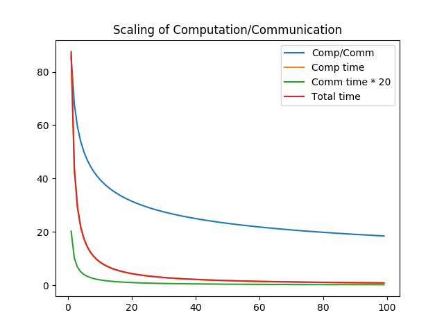

Choosing an Algorithm
=====================

Think Parallel
--------------

-   You wouldn't be on this course if you were dealing with tiny problems
-   Parallelism is *nested*: you should try to exploit all levels
-   Large problems take too long without parallel processing (numbers based on a 3.5 GHz Pentium F core from late 2004 and 22-core Broadwell-EP E5v4 at 2.2 GHz; Xeon Phi numbers are guesses for Knights Landing)
    -   The Time of the Serial is over: no serial performance increase worth mentioning since 2005!
        -   In fact highest performing parallel processors' serial performance is only 40% of the 2005 level
    -   Parallel performance increase over serial performance **per core** (and per Hz) since 2005: **32x**!
    -   Even if you can wait at least 32 times longer, others won't and will scoop your result
    -   This performance provided by *SIMD* vector processing unit(s)
        -   GPU and FPGA co-processors offer similar functionality but are outside the scope of this course
-   Second level of parallelism, *multicore* and *manycore*
    -   Gives another **10x** or so over 2005 performance
        -   Xeon Phi gives **30x**
    -   SIMD and multicore together give 200x (\(\ne\) 320x!) and Xeon Phi even 1000x!
-   This performance does not come for free
    -   Efficient use of SIMD needs careful programming
    -   Efficient many-/multicore somewhat easier, but
    -   Do not worry about it yet --- much can be gained from choosing a good library
    -   But do plan for it from the beginning:
-   Parallel processing should be part of program design
    -   You should choose a parallelisable algorithm
        -   Example: mergesort is easy to parallelise, heapsort is very inefficient in parallel
    -   It must be implemented such that it can exploit SIMD and many cores

OpenMP
------

-   compiler-based approach to parallel programming (and some other things, too)
-   can also be used to offload to accelerators/GPUs
-   needs a single, shared memory node to operate: use MPI to distribute across nodes, OpenMP to parallelise inside a node
-   cosmos has an unusual case of shared memory across nodes (properly called NUMA-nodes in this case), so both work
-   OpenMP and NUMA issues
-   OpenMP is shared memory model with implicit parallelism, so must be careful with what is shared and what is not
    -   false sharing
    -   data corruption can occur
    -   correct which is correct on one thread can suddenly be incorrect with OpenMP parallelism
    -   must use critical/atomic sections to guard shared written data
        -   effectively non-parallel region in an otherwise parallelised chunk
        -   example
-   OpenMP can also deadlock
-   we have course material, can even run a course if needed

Think Distributed --- Parallel Taken to the Extreme
---------------------------------------------------

### "The Third Level" of parallelism

-   Lash several, even millions, of machines (*nodes*) together using an *interconnect* to work together on the same problem
-   Distribute problem data across nodes, each node working on its part of the problem
    -   Embarrassingly parallel: nodes work on different problems (possibly same equation with different parameters)
        -   MapReduce/Hadoop
-   The 32x and 1000x above can "now" become much bigger, even 8 000 000x

Decrease time-to-solution: *strong scaling*
-------------------------------------------

-   assume an **ideal** world
-   now the inter-node communication becomes a bottle-neck: theoretical limit

<span class="label">Strong Scaling in an Ideal World</span>
``` {#fig:domain_decomp_strong_scaling .python}

```



-   **conclusion**: even in an ideal world strong scaling eventually gives no benefit
    -   related to Amdahl's Law which we will meet soon
-   often load balancing becomes an issue well before the natural limit hits you

Increase problem size past single node: *weak scaling*
------------------------------------------------------

-   No more universal limit, in principle just add nodes to get bigger problem sizes
-   **algorithm** limits the scaling now
    -   Notoriously bad: Fast Fourier Transform
        -   Needs to transmit **volume**: in strong scaling surface was enough to kill scaling...
        -   TODO!!! Fast Multipole Method can often help here
-   Load balancing is often problem here, too
    -   Most n-body codes suffer from this as even initially well balanced bodies tend to cluster and wreck the balance
    -   Task-based parallelism helps here, but often suffers from poor data locality: ways around that are complicated but exist
-   Choice of a good algorithm again very, very important

Ensure scalability first
------------------------

-   As a rule of thumb, think what happens if your problem becomes 1000000 times larger
-   It's the hardest to deal with afterwards
-   Write smart, well designed code, optmimise on-core performance later
    -   But expect it will change its scaling characteristics (c.f. <fig:domain_decomp_strong_scaling> --- the initial ratio will change)
-   So, for now, we'll write distributed parallel code and worry about on-node and in-core performance later
-   Fortunately, a good choice of scientific library will deal with most distributed computing issues
    -   On this course, we will use *PETSc* but there are others, like TODO!!!

An aside: offload to an accelerator or GPU
------------------------------------------

-   Provides much higher performance/watt than normal CPU
-   We use Xeon Phi in the examples; GPU is similar but slightly trickier
-   Can be done explicitly, but almost never worth the effort: Intel's compiler has two ways to offload using compiler directives (pragmas) only, LEO and OpenMP.
-   GPU very popular in e.g. machine learning and neural networks, so transferable skill

### Example/Cookbook

-   some basic example
-   courses available

Cookbook: TODO!!! example algorithms (though no code yet)
