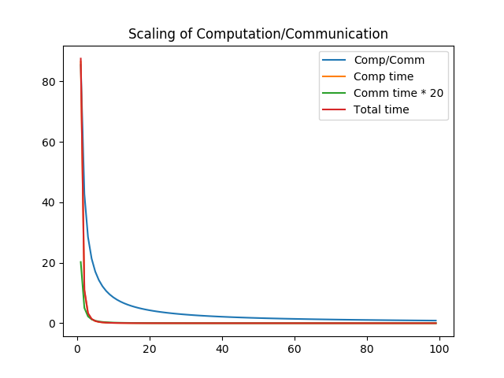

Choosing an Algorithm
=====================

Difficult and Big Problems: Think Parallel
------------------------------------------

-   You wouldn't be on this course if you were dealing with easy, tiny problems
-   Parallelism is *nested*: you should try to exploit all levels

### First Level of Parallelism: SIMD

-   *SIMD* = Single Instruction Multiple Data
-   Large problems take too long without parallel processing [1]
    -   The Time of the Serial is over: no serial performance increase worth mentioning since 2005!
        -   In fact highest performing parallel processor's serial performance is only 40% of the 2005 level
    -   Parallel performance increase over serial performance **per core** (and per Hz) since 2005: **32x**!
    -   Even if you can wait at least 32 times longer, others won't and will scoop your result
    -   This performance provided by the SIMD capabilities of vector processing unit(s) (*VPU*)
        -   GPU and FPGA co-processors offer similar functionality

### Second level of parallelism: *multicore* and *manycore*

-   Gives another **10x** or so over 2005 performance
    -   Xeon Phi gives **30x**
-   SIMD and multicore together give 320$×$/Hz (or 200x real) and Xeon Phi even 1000x!

### This performance does not come for free

-   Efficient use of SIMD needs careful programming
-   Efficient many-/multicore somewhat easier, but
-   Do not worry about it yet --- much can be gained from choosing a good library
-   But do plan for it from the beginning!

### Parallel processing should be part of program design

-   You should choose a parallelisable algorithm
    -   Example: mergesort is easy to parallelise, heapsort is very inefficient in parallel
-   It must be implemented such that it can exploit SIMD and many cores

OpenMP: a way to exploit the second level
-----------------------------------------

-   compiler-based approach to parallel programming (and some other things, too)
-   can also be used to offload to accelerators/GPUs
    -   unfortunately generally not in a portable way
-   needs a single, shared memory node to operate: use MPI to distribute across nodes, OpenMP to parallelise inside a node
-   but some nodes have non-uniform memory access, *NUMA*, which is tricky to use well
    -   using NUMA "wrong" will slow your code to a crawl
-   OpenMP provides some tools for exploiting SIMD as well, but generally should only be used as a last resort

### OpenMP and NUMA issues

-   OpenMP is shared memory model with implicit parallelism, so must be careful with what is shared and what is not
    -   false sharing (we'll return to this later)
    -   data corruption can occur
    -   code which is correct on one thread can suddenly be incorrect with OpenMP parallelism
    -   must use critical/atomic sections to guard shared written data
        -   effectively non-parallel region in an otherwise parallelised chunk
-   OpenMP can also deadlock
-   we have course material on this, can even run a course if needed
-   OpenMP is the oldest and really best suited for C/Fortran and simple parallelisation of loops
-   Depends on sometimes shaggy compiler-dependent runtime libraries
    -   Often find bugs in these, takes long to get them fixed
    -   Compilers support different parts of the standard: code portability is questionable

Modern ways to exploit the second level
---------------------------------------

### Threading Building Blocks (TBB)

-   Intel-sponsored Open Source project written in C++11
-   Parallelism comes from breaking problem into tasks which are executed in parallel
-   Much more capable in exploiting a node (whether NUMA or not) than OpenMP
    -   But a bit steeper learning curve
-   Has python bindings since version 4.4!
-   Has issues using threaded libraries
-   Can be used with accelerators

### dask and dask.distributed

-   Similar to TBB but entirely python
-   With `dask.distributed` you can go beyond a node, distributed (more on that in the next section)
-   Interactive in proper python style
-   Not much of a learning curve, but need to understand what a DAG is (but git is also a DAG, so you know this already!)
-   Very easy to set up and start using: can do single core on laptop etc
    -   Unfortunately not enough time to cover `dask` in this course
-   Can largely replace Map/Reduce and/or Apache Spark, but does not limit to those use cases and paradigms!
-   Has issues using threaded libraries
-   Can also be used with accelerators

### ipyparallel

-   A simpler, less powerful parallel processing tool
-   Still has a learning curve almost identical to dask
-   But we still use it on this course (shame on me!) for the *third* level of parallelism

### python has many other packages

-   threading (from standard library)
-   multiprocessing (also from standard library)
-   hard to decide which to learn

Think Distributed --- Parallel Taken to the Extreme
---------------------------------------------------

### The Third Level of Parallelism

-   Lash several, even millions, of machines (*nodes*) together using an *interconnect* to work together on the same problem
    -   top-1 has 40960 nodes (machines) with 256+4 cores each (you do the maths)
    -   top-4 has 98304 nodes with 16+1 cores each
    -   trend is to increase cores/node and not so much \# nodes
-   Distribute problem data across nodes, each node working on its part of the problem
    -   Embarrassingly parallel: nodes work on different problems (possibly same equation with different parameters)
        -   MapReduce/Hadoop
        -   Apache Spark
-   The 32x and 1000x above can "now" become much bigger, even over 1 000 000x

Decrease time-to-solution: *strong scaling*
-------------------------------------------

&lt;&lt;Strong Scaling&gt;&gt;

-   assume an **ideal** world
-   now the inter-node communication becomes a bottle-neck: theoretical limit

-   **conclusion**: even in an ideal world strong scaling eventually gives no benefit
    -   related to Amdahl's Law which we will meet soon
-   often load balancing becomes an issue well before the natural limit hits you

Increase problem size past single node: *weak scaling*
------------------------------------------------------

-   No more universal limit, in principle just add nodes to get bigger problem sizes
-   **algorithm** limits the scaling now
    -   Notoriously bad: Fast Fourier Transform
        -   Needs to transmit **volume**: in strong scaling surface was enough to kill scaling...
        -   Fast Multipole Method can often help here
        -   Fourier is nice on pen and paper, but not often a good choice on computer: consider *multigrid*
-   Load balancing is often problem here, too
    -   Many n-body codes suffer from this as even initially well balanced bodies tend to cluster and wreck the balance
    -   Task-based parallelism helps here, but often suffers from poor data locality: ways around that are complicated but exist (*QuickSched*)
-   Choice of a good algorithm again very, very important

Ensure scalability first
------------------------

-   As a rule of thumb, think what happens if your problem becomes 1000000 times larger
    -   Dealing with just 100 times larger is no easier
-   It's the hardest to deal with afterwards
-   Write smart, well designed code, optmimise on-core performance later
    -   But expect optimising will change the scaling characteristics (c.f. *Strong Scaling* --- the initial ratio will change and usually to the worse)
-   So, for now, we'll write distributed parallel code and worry about on-node and in-core performance later
-   Fortunately, a good choice of scientific library will deal with most distributed computing issues
    -   On this course, we will use *PETSc* but there are others, like
        SLEPc  
        everything you want from matrices, sparse or otherwise (depends on PETSc)

        ScaLAPACK  
        only ever use for matrices that cannot be stored in sparse format

        FEniCS  
        A Finite Element Method (FEM) solver library (lots of dependencies, including PETSc)

        ClawPACK/PyCLAW  
        A Finite Volume Method (FVM) solver library (you guessed it, depends on PETSc)

        Trilinos  
        the only real alternative to the PETSc family in very large scale frameworks, but very complex to install: contains 57 separate packages!

        FFTW  
        "the standard" FFT library, has shortcomings but (although you probably want to build your distributed version out of non-distributed 1D FFTs)

An aside: offload to an accelerator or GPU
------------------------------------------

-   Provides much higher performance/watt than normal CPU
    -   Knights Landing (and SW26010) have turned the tables
-   We do not have the time, but might do so in a later course!
-   Can be done explicitly, but almost never worth the effort: OpenMP, OpenCL and other methods provide at least a semblance of portability unlike explicit methods
-   Not so easy with python (but there's a solution)
-   GPU very popular in e.g. machine learning and neural networks

Exercises
---------

### Laplacian

-   write a function to compute the discrete Laplacian of some data
-   the function shall have three inputs:
    -   the data whose Laplacian is to be computed
    -   a variable to hold the resulting Laplacian
    -   a variable describing the discrete lattice
-   the function declaration shall be `def Laplacian(indata, result, d)`
-   remember the correctness tests
-   in jupyter/ipython you can use `%timeit Laplacian(X,Y,d)` to test your performance (but we'll deal with optimisation next week)

### Simulated Annealing

-   write a function implementing the iterative step of the simulated annealing algorithm:
-   for those who do not know the algorithm, see <https://en.wikipedia.org/wiki/Simulated_annealing#Pseudocode>
-   the function shall have two inputs:
    -   the data to shuffle
    -   the current temperature
    -   objective function (this is called to compute the cost of the new configuration)
        -   the iterative step function will dictate the declaration of the objective function!
    -   auxiliary data (the objective function most likely needs some data more than just the data)
    -   if you want, you can optimise by passing also previous cost, so it does not need to be recalculated
-   the function declaration shall be `def SimAn(data, temperature, ObjFunc, aux_data, prev_temp=None)`
-   and the tests again, please
-   as practice you can also `add` and `commit` these to your local copy of the course repo, but recall that you will most likely `git reset --hard` at the beginning of the next lecture!

