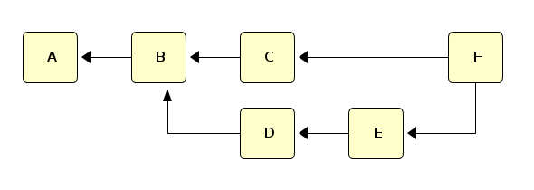
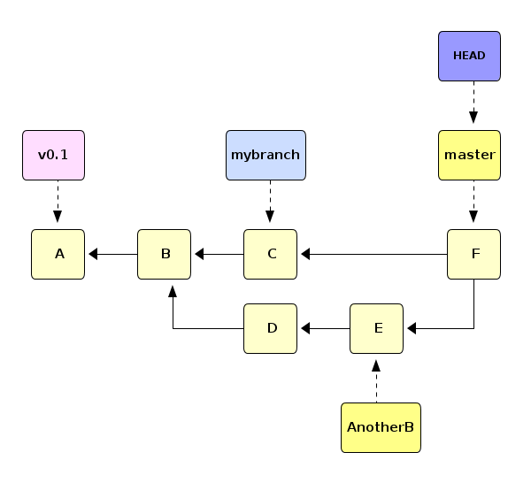
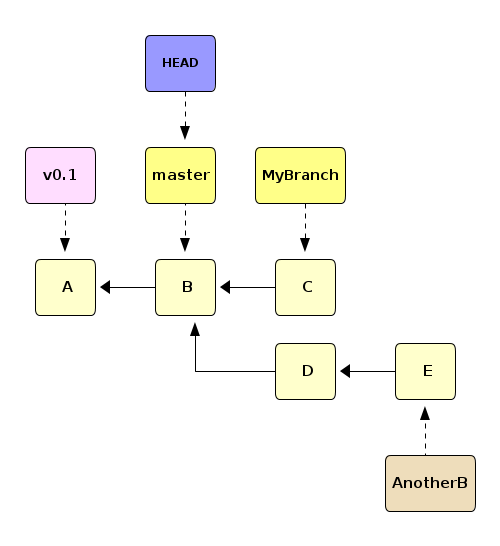

git, a distributed and decentralised version control system
===========================================================

Of All Good Practices, Version Control Is The Most Important
------------------------------------------------------------

-   Always a good thing to consider doing things in a distributed and decentralised way
    -   it will scale to just about any size you can think of (sometimes needs a small extra effort)
    -   opens door to not just industrial best practices, peer-to-peer software ideas, and some very important coding styles in industry but also to solving very large scale (numerical) problems in science

Version Control System
----------------------

-   tracks and provides control over changes to the project (source code in most cases)
-   enables to check when, why and by whom the given change was introduced (especially useful in hunting down bugs where something used to work before)
-   simplify simultaneous work on different features
-   simplify collaboration with other people
    -   know who changed what and when
    -   can usually automatically incorporate other people's changes to yours
    -   ability to pick only some edits by other people instead of all of them

git Building Blocks
-------------------

### A commit

-   Snapshot of the state of project when the given (set of) change(s) was introduced together with additional information
    -   date
    -   author
    -   committer
    -   commit message which should briefly explain the change(s) made after previous commit
    -   list of parents (can be more than one or even zero)

### A git repository (or just repo)

-   Simply a list of commits
-   Represented by a DAG: Direct Acyclic Graph
-   Let A...F be commits, the DAG could then be e.g.



### A branch

-   a separate (independent) line of development in the same repo
-   technically, branch is just a nickname for a commit which gets moved to new commits as they are made
-   the `master` branch always exists; our example repo also has a branch called `mybranch`
-   current branch has a special pointer `HEAD` pointing to it (usually to the newest commit)
-   any commit can have a *tag* permanently attached to it
    -   often released versions of code would have a tag
    -   or the version used for a particular article
-   git also remembers the state of the branch on a remote (another distributed copy of the project)



### Specifying a particular commit

-   `HEAD` means the current commit on the current branch (usually the chronologically latest)
-   a string like `92db05f2a784fe0a715de29fc97172eac6bb5089` is an sha1 hash of a commit, supposedly unique
-   name of a branch (master, mybranch, ...)
-   a tag, like `v0.1`
-   `rev^` refers to the parent of `rev`, `rev^1`, `rev^2` etc refer to next parents
-   `rev~n` refers to the nth ancestor of `rev`
-   in the diagram, we've now hidden some of the labels which still exist


### Specifying Ranges of Commits

-   `rev` means all ancestors of `rev`
-   `--all` means all
-   `rev1..rev2` means commits reachable from `rev2` but not from `rev1`
    -   in our diagram `D..F` would mean just `C`
-   `rev1..` is a short for `rev1..HEAD`, i.e. from current commit all the way to `rev1` but not further

Merge
-----

-   Merge happens when two distributed copies both have made changes and one attempts to combine them
-   Let's create a repository and initialise it to a known state
-   first just initialise it

``` {.bash}
    DIR=$(mktemp --directory ./git-repo-XXXXXXXX)
  cd ${DIR}
  git init .
```

-   start adding files, first one file and the `v0.1` tag

``` {.bash}
    echo 'Our file has initially this content' > my_file.txt
  git add my_file.txt
  git commit --message='Initial commit of version 0.1'
  git tag --annotate --message='This tags the HEAD as version 0.1 with tag name v0.1' 'v0.1'
```

-   then we edit the file and add another, this becomes the "B" in our graph

``` {.bash}
    sed --in-place 's/has initially/now has/' my_file.txt
  echo 'We also now have another file here' > my_second_file.txt
  git add my_second_file.txt
  git commit --all --message='Added my_second_file.txt and edited my_file.txt to reflect the current state'
```

-   create the new `MyBranch` branch and switch to it

``` {.bash}
    git branch MyBranch
  git checkout MyBranch
```

-   add a file to the new branch

``` {.bash}
    echo 'This file only exists on MyBranch' > file_on_MyBranch.txt
  git add file_on_MyBranch.txt
  git commit --all --message='Created a new branch called MyBranch and added file_on_MyBranch.txt'
```

-   switch back to `master` (you could branch from `MyBranch` again, but that's not what our graph looks like) and create `AnotherB`

``` {.bash}
    git checkout master
  git branch AnotherB
  git checkout AnotherB
```

-   edit `my_file.txt` on `AnotherB` (elsewhere its contents are unchanged)

``` {.bash}
    sed --in-place 's/now has this content/has different content on AnotherB/' my_file.txt
  git add my_file.txt
  git commit --message='Edited my_file.txt to reflect the state on current branch'
```

-   add a new file to this branch

``` {.bash}
    echo 'A completely new file on AnotherB' > file_on_AnotherB.txt
  git add file_on_AnotherB.txt
  git commit --message='Added file_on_AnotherB.txt'
```

-   go back to master: no changes to contents but this is needed to move `HEAD` where it is in the graph

``` {.bash}
  git checkout master
```

-   We now have the following state



-   suppose you want to incorporate `MyBranch` to `master` now
    -   it does not matter who made the changes in `MyBranch`
-   whole on `master` run `git merge MyBranch`

``` {.bash}
  git merge MyBranch
```


-   this is called a *Fast-Forward* merge (all changes are on the branch)
-   merging `AnotherB` is not a FF merge, as it might have conflicts from edits on different branches
    -   conflicts need to be handled manually and probably in consultation with other authors
-   this calls for a new commit, a commit with two parents

``` {.bash}
  git merge --no-edit AnotherB
```


