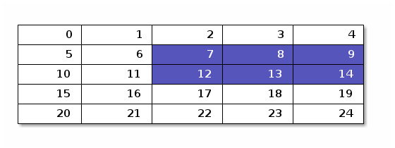

Message Passing Interface
=========================

Logging in and accessing the Microsoft Azure Cloud HPC cluster
--------------------------------------------------------------

1.  Get your username and password — don't lose them
2.  Use ssh to log into `slurmcluster01.westeurope.cloudapp.azure.com` using your username and password.
3.  Change directory to `/share/data/yourusername`
4.  Clone the course repo `git clone git@github.com:juhaj/damtp-research-programming.git`
5.  Start your copy of jupyter: `my_jupyter`
6.  Make note of the URL (or just token) presented
7.  Replace the `localhost` bit of the URL with `http://slurmcluster01.westeurope.cloudapp.azure.com`
8.  Point your browser there (note that the whole Cambridge course material up to yesterday's lecture is there, have fun).
9.  Feel free to poke around nicely and use jupyter, python, C, C++, whatever; you should use `srun` for MPI jobs

Parallel Processing
-------------------

-   processing, not necessarily computing, as the example will show

### Painting a heptagonal wall

Suppose we had a heptagonal wall. We want to paint seven vertical stripes on each side: red, orange, yellow, green, blue, indigo, and violet stripe. Furthermore, the order of the stripes must be the same on each section of the wall --- it would not look like a rainbow otherwise.

Our painting company is located on a loose union of seven independent island states in the middle of the ocean and since we need to keep all seven governments happy, we paint one side on each island, and ship them to the customer separately. How do we do this? The *parallel algorithm* is simple:

1.  Send instructions to each island. The instructions state the order of the colours and instructions to send pots of paint to (and receive from) the other islands in a particular fashion as described later. Every painter is assigned a colour to start with (and consequently also where along the horizontal length of the wall to paint that: recall that the colours must be in the order of the spectrum)
2.  Every painter build a piece of the wall (as described in the instructions).
3.  Every painter on every island goes on to a paint shop to buy a pot of paint of their assigned colour.
4.  <span id="paint_loop_begin"></span>Every painter paints a stripe.
5.  Every painter looks at the instructions of where to mail their remaining paint, posts the paint and collects their new pot when it arrives, waiting idly until it does.
6.  Unless the whole wall is painted, go back to [Every painter paints a stripe.](#paint_loop_begin)
7.  Ship the piece of the wall to the customer.

Now, you see how this becomes parallel computing: just change islands to computers, painters to processes etc. What is important to notice here is **all painters do exactly the same thing**: pick up paint, paint, mail paint, receive paint, repeat previous three until wall is painted and then ship the wall away. The algorithm is completely symmetric, just the initial values (first colour and as a consequence the whole sequence of colours) differ.

It is not strictly necessary to have a completely symmetric algorithm, but for the purposes of this course we will stick to symmetric algorithms where the only asymmetry is interaction with user: only one painter talks with to the company HQ or client.

**N.B.** In a parallel code, the meaning of "program" is often ambiguous: it may refer to one of the painters (more properly called *process*) or the whole parallel contraption. We will try to avoid this dual use by using *parallel code* for the whole and *process* for the individual painter.

### Relations between painters and processes

MPI has some precise meanings for words like *rank*, *communicator*, *point-to-point* message and *collective* message. There are other concepts for more complicated things, but we won't need them.

`rank`  
In our island example, each painter corresponds to an MPI *rank*; technically, a rank is a single process (program) running on a computer somewhere. Traditionally, each CPU core would run an identical process, possibly having `if`-statements to implement an asymmetric algorithm, but that is not always the case. On this course, all the ranks will always be identical in code (but not completely symmetric) and we leave it to the adventurous to figure out how to have different processes.

`communicator`  
This is **a** postal service: there may be multiple communicators in a single parallel code (and in fact there always are at least two) and these postal services might or might not service all the islands. The two always-present communicator server all island and an no islands other than the one they are on (i.e. the other can only be used to send mail to yourself). In general, a communicator covers any subset of the ranks, including all and the empty set (though I find the latter rather useless). Every message sent will be associated with precisely one communicator and the communicator defines the possible senders and receivers; who actually sends/receives and what is defined at the time of sending/receiving.

`point-to-point message`  
These originate from one rank within a communicator and are received by a rank (possibly the same!) within the same communicator. The pots of paint we sent were point-to-point messages.

`collective message`  
These messages involve every rank in the communicator. Depending of the type of collective, it could be one-to-all, all-to-one or all-to-all. If the customer in our example was part of the MPI code, the final shipping of the walls would be an all-to-one message (`MPI_Gather()` to be precise).

You might now wonder about the "if" in the last sentence: normally in a parallel code only diagnostic information is sent all-to-one, not final results as that would introduce a bottleneck: if all the walls were shipped to one of the islands, they would have a hard time sorting them all out in the port and storing them. A typical MPI code holds so much data in memory, that no single computer can do that, so sending it all to one rank is out of the question (and even if you could do it, please do not --- it is a bad practice and will come back to haunt you later).

### Load balance

Our example is very simple and has what is called perfect *load balance*: every painter has exactly the same amount of work to do. In our example this was very easy because of the high degree of symmetry in the algorithm and such algorithms are usually preferable to ones where such easy load balancing is not possible.

You will notice the above assumes the painters all take the same amount to time to paint and mail, this is the desired situation. This is usually the case as most clusters have identical computers. Of course, if one painter is slower, others will need to wait and we are better off if faster painters are given more work. However, this is not easy to manage at all and system designers appreciate this, so you will very rarely find systems where different computers would be of different speed. [1]

It is worth noting that unequal load balance can usually be ignored on small scale problems, but once the problem size grows, the load balance usually becomes worse and worse. This means many ranks just wait without doing anything productive: the painter waits for its next pot of paint. The painter may need to take a break to sleep and eat, but your computer doesn't.

### Data and Task Distributed Parallelism

The islands example is an example of *data distributed* parallelism. This is what MPI was originally designed for. The main reasons for distributing data are to be able to access more memory than any single computer has and to be able to bring more compute-power to bear on the problem, again more than any single computer can. Data distributed parallelism works well for this and it usually ensures almost perfect load balance as well: as long as data can be distributed evenly (and there rarely is a reason not to), every rank has the same amount of job to do, so all one needs to take care of is to use as symmetric an algorithm as possible.

Task Distributed parallelism is a distributed version of task based parallelism on a single computer: the problem is broken down into tasks. Our islands example could be broken down to 49 tasks: 7 stripes of 7 colours and on a single computer that works very well. However, once things get distributed to different computers we suddenly have data locality constraints: painter A on island 1 with blue paint cannot paint the wall on island 2. Something needs to move. In data distributed, the paint moves and this is ok: there is not that much paint to move; one could even just send a voucher to get paint from the local DIY store. However, with task distributed parallelism, the data (wall without blue stripe) on which to operate will not always be where the process (painter with blue paint) is and orchestrating the data movements in an efficient way is difficult. Very difficult. Extremely hard. Fiendish.

The solution is to have two types of tasks with dependencies between them: processing tasks and data movement tasks, but then one needs to keep track of the dependencies and still orchestrate everything. The dependencies will allow the data movement tasks to arranged to happen "in the background" so wall without blue stripe will be in transit to island 1 while painter A paints the previous wall.

There are two obvious and immediate problems with this. There always needs to be no less than one wall in transit, so in our islands example, using 7 painters would become pointless as at least one would always be without a wall to paint on. Of course, the walls could be split into individual colour sized chunks: now we have 49 pieces of wall and enough for everyone to have something to paint on while other pieces are in transit. However, it is not easy to determine the right task size because the time it takes for a wall to go from island 2 to island 1 must be less or equal to the time it takes painter A to paint the previous wall. This is hard to judge, determine and ensure.

There are libraries to help you with this: dask, TBB, hStreams, QuickSched; some require you to write your DAG yourself, some, like dask and hStreams, infer it from your code.

### Let's Speed Up My Old Code

Parallelism is not well suited to speed up existing codes. There are two main reasons. First, if the algorithms used are parallel, using MPI/threads will not give much advantage. Second, non-distributed codes are very often designed in a way which would imply collective all-to-one communications like sending all the walls to a single island.

Both of these are hard to change in an existing code and it is likely a redesign of the code is easier --- assuming one has followed good code development practices and can easily test the correctness of the respective codes.

Finally, one could imagine "just accelerating" the most time-consuming parts of the code; there are many ways of doing this: using an accelerator like a GPU or Xeon Phi, using OpenMP threading (we will cover that later), or MPI. However, they all must obey a universal equation known as *Amdahl's Law*.

Suppose a code is partly run in *serial* (as opposed to parallel) and another part in parallel and that there are no latencies or overheads in the parallel part, i.e. using N parallel workers cuts the time spent to 1/N. Now every parallel code has a serial part: if nothing other, at least the startup and shutdown of the code are invariably serial. Note that even though every worker reads their instructions in parallel, this does not count as a parallel part of the code in this sense as the time spent does not depend on the number of painters: it is duplicated rather than distributed work. With these very generous assumptions, Amdahl's Law can be states as follows. Suppose the serial part takes *t*<sub>*s*</sub> units of time and parallel part with single worker takes *t*<sub>*p*</sub>, then with *N* parallel workers, we get *total* code runtime speedup *s* of


$$\begin{equation}
s = \frac{t_{s}+t_{p}}{t_{s}+\tfrac{t_{p}}{N}} \xrightarrow{N \to \infty} 1 + \frac{t_{p}}{t_{s}}.
\end{equation}$$

The ratio $\\frac{t\_{p}}{t\_{s}}$ is related to the `Comp/Comm` ratio we saw earlier, but more general: this includes not just communications, but initialisation (although parts of it are often parallel), control flow, etc. Hence, even under these favourable ideal assumptions, you cannot expect big speedups unless your *t*<sub>*p*</sub>/*t*<sub>*s*</sub> is rather very large and unfortunately this is rarely the case. In one of the examples in this course, the ratio is approximately 5, without accounting for the fact that some of the "parallel" parts are in fact serial in the same sense as the reading of the instructions is in our islands example. So the maximum speedup you can dream of is **6x**, i.e. do in one hour what used to take six.

Canonical example: MPI Hello World
----------------------------------

### In non-interative python

``` python
import mpi4py
from mpi4py import MPI
size=MPI.COMM_WORLD.Get_size()
print("Hello, World. I am rank "+
      "{rank: 0{len}d} of your MPI communicator of {size} ranks".format(
      rank=MPI.COMM_WORLD.Get_rank(),
      len=len(str(size)),
      size=size))
```

``` python
%%bash
srun --ntasks 23 python3 ../codes/python/mpi_hello_world_worst.py
```

-   There is no easy way to run interactive MPI jobs
    -   it is inherently non-sequential and interactivity with humans is inherently sequential
-   however, there's a python module called `ipyparallel` \[fn:dask<sub>workstoofootnote</sub>: Dask will also work but it's more complicated and its delayed execution model is quite alien to the typical MPI usage so we skip it here.\] which gives some level of interactivity
    -   but the non-sequential nature of parallel jobs bring some complications when a sequential interface is built on top of it
    -   we will look at this in a moment
-   If you do not believe interactive MPI is no fun, this is how to do it: `srun --ntasks 8 xterm -e python3`
-   You end up with 8 separate terminal windows and every single python command must be typed in ALL of them.
-   There are terminal multiplexers which can take one input and replicate it to N terminals, but you still end up with N+1 terminal windows.

### In C++

``` shell
%%bash
cat ../codes/cpp/hello.cpp
mpicxx -o hello ../codes/cpp/hello.cpp
srun --ntasks 23 ./hello
```

### The ipyparallel module

As seen above, python and MPI is not as nice and interactive as python usually is; and a compiled language like C of course never is. We want to change that and the easiest (though still non-trivial) and nicest way to do this is to use a python module called ipyparallel. \[fn:installed<sub>ondamtp</sub>: This has been installed on the DAMTP desktops and you will be able to use it after `module load ipyparallel` and loading the backend with \\verb{ipyparallel start -n &lt;n&gt; --daemon=False --engines=MPI}\]

More details in [ipyparallel documentation](http://ipyparallel.readthedocs.io/en/stable/intro.html).

Using ipyparallel is like using any python module: `import ipyparallel` and off we go. However, it requires a bit of setup before it can be used. It has two parts: a backend called `ipcluster` which is where all the computation happens and where the MPI ranks and communicators live, and an `ipcontroller` which controls the backend as instructed by the user typing into the python prompt or by the python code being executed: ipyparallel can of course be used also non-interactively.

It is worth knowing that ipyparallel is not inherently an MPI code: MPI must be explicitly brought in somehow. It is quite possible to use ipyparallel without MPI, too, but then communication between backend workers is not possible: the painters cannot send pots to each other, every pot needs to be sent to the HQ (ipcontroller) and then back to painters. Needless to say, for a code requiring anything but trivial communication, this becomes a bottle neck very quickly even if the computational data (walls) were not sent around but just small bits of instruction or such (pots of paint or vouchers).

Also, when using MPI with ipyparallel, the ipcluster, the ipcontroller, and the user's python **do not share** any communicator. They are completely different MPI universes; in fact, the ipcontroller and user's python do not even need to have MPI brought in at all (but some things may be simpler to do if they have).

Let us initialise `ipyparallel` now. The first line just imports `ipyparallel` module like any module and the second line creates a "client" connection to the ipcontroller, i.e. gives us the ability to use the parallel workers. (The parameters to `Client()` are specific to the training setup --- on a DAMTP desktop you should not need them.)

This will make sure the environment for parallel processing using ipyparallel exists: if you want to do this outside of jupyter, simply copy-paste into a shell on the machine you want to run your ipyparallel backends.

``` python
%%bash
ipcluster stop --profile=mpi_slurm --cluster-id='Azure_cluster_0'
sleep 5
```

``` python
%%bash
ipcluster start --profile=mpi_slurm -n 8 --engines=MPI --cluster-id='Azure_cluster_0' --ip='10.0.0.254' --MPIEngineSetLauncher.mpi_cmd='["srun"]' --daemon=True
```

and

``` python
import ipyparallel
c = ipyparallel.Client(profile="mpi_slurm", cluster_id='Azure_cluster_0')
```

-   By default, `ipyparallel` has no modules imported and
-   doing `import module` will only import `module` on to your interactive frontend.
-   There are two typical ways of importing into the backends.
    1.  The first will import to backends **only** and
    2.  import on both front and backends:

``` python
c[:].execute("import numpy").wait()
if not("numpy" in dir()): print("No numpy here!")
with c[:].sync_imports():
    import scipy
if ("scipy" in dir()): print("scipy here!")
```

-   If you have ever done something like `ParallelMap[#+1&, Table[Random[], {i,1,18}]]` in mathematica, ipyparallel (without MPI) is designed for precisely this kind of stuff.
-   In fact, you could do the same in ipyparallel very easily:

``` python
# We need to load numpy also on frontend
import numpy
data = numpy.random.random(18)
c[:].map_sync(lambda x:x+1, data)
```

-   The slice `c[:]` simply chooses which workers to use.
-   As usual an empty start- or end-point means "up to and including the first" or "up to and including the last".
    -   We could use just 2 with

``` python
c[:2].map_sync(lambda x:x+1, data)
```

-   or even from the middle of the range:

``` python
c[1:3].map_sync(lambda x:x+1, data)
```

-   We will soon learn that there are other ways to do this, too:
-   most importantly, we will learn how to define functions which will always transparently execute on the parallel workers, i.e. they look and feel and are used like normal interactive python functions, but magic happens when they execute.

### In interactive python (ipyparallel)

-   initialise

``` python
import ipyparallel as ipp
c = ipp.Client(profile="mpi", cluster_id="training_cluster_0")
c.ids
directview=c[:]
directview.execute("import mpi4py").wait()
directview.execute("from mpi4py import MPI").wait()
```

-   pass some data to workers asynchronously, let them do their work, gather results and output

``` python
res1=directview.map(
    lambda data: "Hello, World. I am rank "+
    "{rank: 0{len}d} of your MPI communicator of {size} ranks and was sent data {d}".format(
        rank=MPI.COMM_WORLD.Get_rank(),
        len=len(str(MPI.COMM_WORLD.Get_size())),
        size=MPI.COMM_WORLD.Get_size(), d=str(data)),
        data)
lista = [x for x in res1.result()]
for output in lista: print(output)
```

-   or using `map` of the Map/Reduce fame

``` python
res1=directview.map(
    lambda data: "Hello, World. I am rank "+
    "{rank: 0{len}d} of your MPI communicator of {size} ranks and was sent data:\n{d}".format(
        rank=MPI.COMM_WORLD.Get_rank(),
        len=len(str(MPI.COMM_WORLD.Get_size())),
        size=MPI.COMM_WORLD.Get_size(), 
        d=data),
        data)
lista = [x for x in res1.result()]
for output in lista: print(output)
```

-   note the clean output: none of the output is generated at the workers, all is done at the frontend

Basic messaging calls in C
--------------------------

The python calls are all called as methods of the relevant communicator instance, e.g. `mpi4py.MPI.COMM_WORLD.Bcast`. The python method names are in parentheses. Please see individual man pages for descriptions.

`MPI_Allgather`  
(Allgather) concatenate same amount of data from all ranks and send result to all ranks

`MPI_Allgatherv`  
(Allgatherv) concatenate some amount of data from all ranks and send result to all ranks

`MPI_Allreduce`  
(Allreduce) reduction operation with results sent to all ranks

`MPI_Alltoall`  
(Alltoall) every rank send data to every rank (think of matrix transpose!)

`MPI_Barrier`  
(Barrier) everyone waits until everyone's here --- should never be needed

`MPI_Bcast`  
(Bcast) one-to-all

`MPI_Comm_rank`  
(rank or Get<sub>rank</sub>()) what's my rank

`MPI_Comm_size`  
(size or Get<sub>size</sub>()) how many ranks are there

`MPI_Finalize`  
(mpi4py.MPI.Finalize()) we are done

`MPI_Gather`  
(Gather) get same amount of data from every rank to a single one

`MPI_Gatherv`  
(Gatherv) get some amount of data from every rank to a single one

`MPI_Init`  
(mpi4py.MPI.Init()) let's start

`MPI_Irecv`  
(Irecv) basic non-blocking message receiving routine

`MPI_Isend`  
(Isend) basic non-blocking message sending routine

`MPI_Reduce`  
(Reduce) reduction operation with results sent to a single rank

`MPI_Scatter`  
(Scatter) inverse of `MPI_Gather`

`MPI_Scatterv`  
(Scatterv) inverse of `MPI_Gatherv`

`MPI_Type_create_struct`  
(mpi4py.MPI.&lt;datatype&gt;.Create<sub>struct</sub>) define a datatype which looks like a struct

`MPI_Type_create_subarray`  
(mpi4py.MPI.&lt;datatype&gt;.Create<sub>subarray</sub>) define a datatype which looks like a subarray (can also be implemented with `MPI_Type_create_struct` but this is easier)

`MPI_Wait`  
(MPI.Request.Wait) wait for non-blocking messaging operations to finish

For simple Cartesian data distribution MPI has good support routines

`MPI_Dims_create`  
(mpi4py.MPI.Compute<sub>dims</sub>) companion to `MPI_Cart_create`: determines optimal rank to Cartesian lattice layout

`MPI_Cart_coords`  
(Get<sub>coords</sub>) rank -&gt; (i,j,k)

`MPI_Cart_create`  
(Create<sub>cart</sub>) create a Cartesian MPI topology: the library knows which rank is "next to" which rank

`MPI_Cart_get`  
(Get<sub>info</sub>) retrieve information about the topology

`MPI_Cart_rank`  
(Get<sub>cartrank</sub>) (i,j,k) -&gt; rank

`MPI_Cart_shift`  
(Shift) who's rank's neighbour in given Cartesian direction

First look at MPI
-----------------

-   We run this with precisely two workers so as to keep things simple
    -   This illustrates how to send and receive messages
    -   This is not the way you want to do things in practice!

``` python
@directview.remote(block=False)
def sendrecv():
    import mpi4py
    from mpi4py import MPI
    import numpy
    databuf = numpy.random.random(5)
    recvbuf = numpy.zeros_like(databuf)
    recv=MPI.COMM_WORLD.Irecv(buf=[recvbuf, databuf.shape[0], MPI.DOUBLE], source=MPI.COMM_WORLD.Get_rank() ^ 0x1, tag=42)
    send=MPI.COMM_WORLD.Isend(buf=[databuf, databuf.shape[0], MPI.DOUBLE], dest=MPI.COMM_WORLD.Get_rank() ^ 0x1, tag=42)
    error=MPI.Request.Waitall([send,recv])
    for rank in range(0,MPI.COMM_WORLD.Get_size()):
        if (MPI.COMM_WORLD.Get_rank() == rank):
            print("I, rank {}, sent\n".format(rank), databuf, "\nand received\n", recvbuf)
    return
ret=sendrecv()
ret.wait()
ret.display_outputs()
```

Map/Reduce with and without MPI
-------------------------------

-   runs one code for many essentially different data
-   many examples and tutorials generate input data on "master" process: avoid that
    -   it does not scale
    -   it is not how Map/Reduce works
    -   it restricts you to small problem sizes
    -   COSMOS is a special case where you can do a medium size problem that way
-   no communication during computation
-   we imported `MPI` to our workers above, so no need to do it again
-   but we now need numpy

``` python
directview.execute("import numpy")
```

This is our "reduce" bit in MPI and without. It does nothing but allocates a buffer `redsum` to receive results into and then calls one of the MPI reduction functions with the input data. As a result, rank 0 will have the result in the function-local variable `redsum` and the others will have their `redsum` untouched, i.e. the value is `numpy.nan` which we initialise to separate them from the reduced result. They all return their `redsum` to the caller.

The decorator `@directview.parallel()`, provided by ipyparallel, tells python this routine must run on the parallel workers and moreover it will chunk and split its input suitably for each worker. Note that the input parameter will **always** be a list, even though we expect just one element.

``` python
@directview.parallel(block=True)
def greduce(localval):
    localval = numpy.array(localval)
    redsum = numpy.zeros_like(localval)*numpy.nan
    MPI.COMM_WORLD.Reduce([localval, MPI.DOUBLE],
                          [redsum, MPI.DOUBLE],
                          op=MPI.SUM, root=0)
    return redsum
def greduce_noMPI(gobalval):
    import functools
    return functools.reduce(lambda x,y:x+y, local_map_noMPI, 0)
```

Our "map" routine is even simpler, it just calculates sum of all elements of its input, `data`, with `data.sum()` and returns the value.

``` python
@directview.parallel(block=True)
def lmap(data):
    sum = numpy.array(data).sum() 
    return sum
```

But we also need to somehow give some data to the parallel reducer. Many examples generate such data on one rank or on the ipyparallel interactive console, but that does not scale at all and produces two nasty bottlenecks

-   the memory on the machine running the console must be big enough for the whole data (or some clever iterator constructs must be used) and
-   all the data gets sent through a single node, the IPController whose bandwidth now limits performance. Best if each rank can figure out its input data independently, just like Hadoop/Mapreduce usually (always?) does.
-   `@directview.remote(block=boolean)` decorator
    -   provided by `ipyparallel`
    -   arranges the decorated function to be called on the remote workers instead of the frontend
    -   once per worker and
    -   all with same parameters (although our parameter list is actually empty)
    -   if `block=True` the function returns after it is finished (like a normal function)
    -   if `block=False` the function immediately return an `ASyncResult` instance as its return value and we need to figure out the actual result later using its methods and attributes
    -   there is another common decorator, `directview.parallel` which also arranges the function to be executed by the available (i.e. not already busy doing something) parallel workers, but now with arguments, which must be a list, scattered to the workers in a maximally symmetric way

``` python
@directview.remote(block=True)
def get_data():
    len = 1e7
    loclen = numpy.ceil(len*1.0/MPI.COMM_WORLD.Get_size())
    myrank=MPI.COMM_WORLD.Get_rank()
    return numpy.arange(loclen*myrank, min(len,loclen*(1+myrank)))
@directview.parallel(block=True)
def get_data_noMPI(myinput):
    len = 1e7
    loclen = numpy.ceil(len*1.0/myinput[0][0])
    myrank=myinput[0][1]
    return numpy.arange(loclen*myrank, min(len,loclen*(1+myrank)))
```

Now we can actually run this beast, one step at a time.

``` python
input_data=get_data()
input_data_noMPI=get_data_noMPI([ [len(directview.targets),i]
                                  for i in range(0,len(directview.targets))])
local_map=lmap(input_data)
local_map_noMPI=lmap(input_data_noMPI)
global_reduce=greduce(local_map)
global_reduce_noMPI=greduce_noMPI(local_map_noMPI)
print(global_reduce, global_reduce_noMPI)
```

Note how just one worker gives the sensible result: that is because `MPI_Reduce` sends the answer to one worker only; `MPI_Allreduce` would broadcast it to everyone but at the expense of a global comm: always worth avoiding.

Running the equivalent code non-interactively does not cause such funny output since there is no `ipcontroller` to gather results (which is not scalable anyway). You can find a directly-runnable version of this code in `codes/python/mapreduce.py`:

``` bash
%%bash
cat ../codes/python/mapreduce.py
srun --ntasks 8 python -- ../codes/python/mapreduce.py
```

Distributed Computing
---------------------

-   runs (typically) one code for essentially single, but distributed, data
-   as the ranks are collectively operating on a single task, they need to communicate during computation

### The maximum of the gradient

-   as an example, we'll compute the gradient of a function over a distributed lattice and find its maximum value
-   immediate problem: discrete gradient depends on neighbouring lattice points, but on a data distributed code sometimes the neighbouring point will belong to a different rank!
-   in MPI we of course pass a message: the message copies the necessary lattice points from the "owner" rank to the "borrower"
    -   the borrower should not alter the values at the points it thus receives
    -   the borrowed points are called *ghost* or *halo* points or cells
    -   the ghost cells are used to make computations near the boundaries
    -   pink is external boundary, grey are the ghost cells; note that vertical axis is periodic
    -   coordinates shown are "global"


-   build this piecemeal, but first, we initialise the parallel environment

``` python
try:
    if (directview):
        pass
except:
    import ipyparallel
    c = ipyparallel.Client(profile="mpi", cluster_id="training_cluster_0")
    directview=c[:]
    directview.block=True
    with directview.sync_imports():
        import numpy
        import mpi4py
        from mpi4py import MPI
```

### define a couple of book-keeping classes

-   as they are just book-keeping the documentation is in their docstrings
-   feel free to reuse them as you see fit (but no plagiarism, please)
-   I ran out of time preparing these so some refactoring was left half-done TODO!!!
-   in general, you do not want every rank to print: it will kill performance
    -   rather gather all messages to a few ranks (or just one) and print from there if every rank's output is needed

``` python
class rankinfo(object):
    '''This holds a few "global" values of our problem,
    like stencil width and problem size.

    Parameters
    ----------

    sizes : tuple of numbers of lattice points without ghost
            points along the coordinate axes (in x,y,z order)

    Attributes
    ----------

    rank : the rank of this class in MPI.COMM_WORLD
    size : the number of ranks in  MPI.COMM_WORLD
    ndim : how many physical dimensions does our lattice have
    periods : periodicity of the lattice
    stencil_width : the number of ghost points needed from
                    outside of the lattice on each side
    localsizes : the number of lattice points along the
                 coordinate axes including the ghost points
    '''
    def __init__(self, sizes):
        '''See above for details of initialisation.'''
        self.ndim=3
        self.periods=[False, True, True]
        self.stencil_width = 1
        self.rank=MPI.COMM_WORLD.Get_rank()
        self.size=MPI.COMM_WORLD.Get_size()
        self.localsizes=[x+self.stencil_width*2 for x in sizes]
directview["rankinfo"]=rankinfo

def serialised_print(msg, topo):
    '''Print out a message from every rank syncronously in rank-order.
    Barrier() is global, so every rank must call it or we deadlock.'''
    myrank = topo.Get_rank()
    for rankid in range(0,topo.Get_size()):
        if (myrank == rankid):
            print(msg)
        topo.Barrier()
    return
directview["serialised_print"]=serialised_print
```

### set up the Cartesian topology for our lattice

-   the `Compute_dims` algorithm is implementation specific, but usually tries to find factors close to each other in size
-   N.B. apart from a few exceptions, the MPI standard specifies an **interface**, not **implementations** so **never** depend on what a particular implementation does behind the scenes: that may change ay any time
-   the important function here is `MPI.COMM_WORLD.Create_cart`, which actually creates the topology

``` python
class topology(object):
    '''This class holds information related to the topology of the MPI
    Cartesian Topology

    Compute_dims() is used to find the most similar siez factors of
    "self.me.size" to distribute the data and subsequently Create_cart()
    actually creates the cartesian topology communicator. This is one of
    the most useful and important MPI calls. The parameter reorder=True
    means the MPI libarary is allowed to give the ranks in the new
    communicator different numbers than in the old one. This allows the
    library to optimise communications between ranks, assuming most
    communication is nearest-neighbour (and if it is not, using a
    Cartesian topology is probably pointless). Finally, Shift() calls
    are used to find who those neighbours are.

    '''
    def __init__(self, rankinfo):
        '''Find out the best distribution of the lattice amonst the ranks of the
        communicator passed inside "rankinfo", create the topology, and
        save information about the neighbours of present rank.

        Parameters
        ----------
        rankinfo : a rankinfo instance describing current communicator

        Attributes
        ----------
        dims : dimensions of the cartesian MPI rank grid (not lattice!)
        topology : the new cartesian topology communicator
        shifts : a dict of dicts of which rank to talk to when going
                 along "X", "Y", or "Z" direcion in "up" or "down"
                 direction

        '''
        self.me=rankinfo
        self.dims=MPI.Compute_dims(self.me.size, self.me.ndim)
        self.topology=MPI.COMM_WORLD.Create_cart(self.dims,
                                                 periods=self.me.periods, reorder=True)
        left,right = self.topology.Shift(0,1)
        front,back = self.topology.Shift(1,1)
        up,down = self.topology.Shift(2,1)
        self.shifts={"X": {"up": up, "down": down},
                     "Y": {"up": back, "down": front},
                     "Z": {"up": right, "down": left}}
    def print_info(self):
        '''Print out textual information of the cartesian topology'''
        coords = self.topology.Get_coords(self.me.rank)
        msg="I am rank {rank} and I live at {coords}.".format(
            rank=self.me.rank, coords=coords)
        msg = msg + "Inverse lookup of {coords} gives rank {rank}.".format(
            coords=coords,rank=self.topology.Get_cart_rank(coords))
        serialised_print(msg, self.topology)
directview["topology"]=topology
```

### set up the datatypes

-   MPI always sends a given number of elements of a particular datatype from consequtive memory locations: you should think of this as always sending a 1D array of a particular datatype and of given length
-   however, we want to send 2D subsets of our 3D data, which is contiguous only on two of the six faces of our cuboid, so we next set up custom datatypes for easy messaging between ranks
    -   with our datatype, sends and receives can be done directly from the actual array because MPI now understands about a datatype whose elements are 2D subsets of a 3D array
    -   with this datatype, we only send *one* element, which is trivially contiguous with itself, but note that *internally* the datatype does not need to be contiguous and in fact only 4 of our 12 datatypes are internally contiguous
-   you will often see examples and codes where data is copied to a temporary buffer for sends and receives instead of using datatypes
    -   this is usually not necessary: once the datatype is set up, it will do the copying for you and your code becomes cleaner and easier to maintain
        -   avoids having an identical loop in several places in the code
        -   change to the comms needs to be implemented in just one place
    -   MPI can sometimes also buffer things internally, causing two copies of data to be used
    -   downside of our approach is **the send buffer must not be altered** before the transfer is complete
-   we need a total of 12 datatypes: one per direction per axis
-   an example 2D subarray of a 2D array
    -   this would be created using `MPI.INT.Create_subarray([5,5], [2,3], [1,2])`
    -   shaded area is the subarray
    -   works similarly in any number of dimensions --- just a bit hard to draw 3D diagrams



``` python
class ghost_data(object):
    '''Ghost communication manager object.

    Basically consists of 12 MPI datatype instances describing the ghost
    send/recv (2) communications in up/down (*2) the three (*3=12)
    dimensions.

    Parameters
    ----------
    topology : a topology instance containing the desired cartesian
               communicator
    sizes : the size of the lattice on this rank (including ghost cells)

    Attributes
    ----------
    types : a dict of dicts of dicts containing instances of the 12
            datatypes; outermost dict keys are axis names, next level
            keys are "send" or "recv" and last level is direction "up"
            or "down"   
    axes : dict of dicts containing the neighbours along the axes; outer
           dict is keyed with axis names, inner dict is keyed with
           direction "up" or "down"
    mx, my, mz : numbers of lattice points along the axes, including
                 ghost points

    Methods
    -------
    None supposed to be called from outside the class.

    '''
    def __init__(self, topology, sizes):
        '''Use MPI.DOUBLE.Create_subarray to create the datatypes required for
        ghost communications. We use MPI.DOUBLE as the underlying unit
        datatype element as our data is of that type.

        The call to Create_subarray() has three arguments
            - the first, sizes, is the (local) size of the full 3D array
              of elements of the basal type
            - the second argument is the size and shape of the subarray:
              this needs to be of the same dimension as the full array,
              but one dimension can be just 1 grid point deep as we do
              here, effectively making it one dimension lower
            - the third argument specifies the grid point where the
              subarray starts, in coordinates of the full local array

        '''
        self.mz,self.my,self.mx = sizes
        self.types = {}
        self.axes = {}
        for axis in ["X", "Y", "Z"]:
            self.types[axis]={}
            self.axes[axis]={}
            for op in ["send", "recv"]:
                self.types[axis][op]={}
                for movements in [("up","down"), ("down","up")]:
                    movement, negmovement = movements
                    self.types[axis][op][movement] = MPI.DOUBLE.Create_subarray(
                        sizes, self.get_plaq(axis),
                        self.get_corner(axis,op,movement))
                    self.types[axis][op][movement].Commit()
                    self.axes[axis][movement]={
                        "dest": topology.shifts[axis][movement],
                        "source": topology.shifts[axis][negmovement]}
    def axis2basisvec(self, axis):
        return numpy.array([axis == "Z", axis == "Y", axis == "X"],
                           dtype=numpy.float64)
    def get_plaq(self, axis):
        vec = self.axis2basisvec(axis)
        pl = [self.mz, self.my, self.mx]*(1-vec)+vec
        return list(pl)
    def get_corner(self, axis, sendrecv, movement):
        vec = self.axis2basisvec(axis)
        axis_size = [x[0] for x in ((self.mx, "X"), (self.my, "Y"),
                                    (self.mz, "Z")) if x[1]==axis][0]
        loc = vec*( (movement=="down") +
                    ((sendrecv=="send")*(movement=="up") or
                     (sendrecv=="recv")*(movement=="down"))*(axis_size-2)
        )
        return list(loc)
directview["ghost_data"]=ghost_data
```

-   You can use `MPI_Type_create_darray()` to create a "distributed array" suitable for e.g. reading to/writing from a binary file in parallel. It will not have ghosts, though, which is what we want here.

### set up routines for exchanging the ghost data

-   we split this in two parts to allow for computation to take place while data is in transit
    -   do that by putting computations between calls to `ghost_exchange_start` and `ghost_exchange_finish`
    -   in practice very few MPI implementations actually transfer any data before the `Wait` call, but one should always allow for the few which do and perhaps others will improve in time, giving your code a free boost
    -   it does complicate code, though, so this code does not take advantage it
-   this simply uses the dictionaries in the class we defined above to loop over the receives and sends
-   **always** post the `Recv` before the `Send` lest deadlocks occur
-   there is also a (blocking!) `Sendrecv` call which is guaranteed never to deadlock

``` python
def ghost_exchange_start(topo, localarray, ghostdefs):
    '''Start sending and receiving the ghost data.

    Parameters
    ----------
    topo : the communicator to use
    localarray : the numpy array to read/write
    ghostdefs : an instance of ghost_data of this particular lattice and
                topology

    Returns
    -------
    commslist : a list of the MPI communication objects that control the
                transfers we started
    '''    
    commslist=[]
    for axis in ["X", "Y", "Z"]:
        for direction in ["up", "down"]:
            commslist.append(
                topo.topology.Irecv(
                    buf=[localarray, 1,
                         ghostdefs.types[axis]["recv"][direction]],
                    source=ghostdefs.axes[axis][direction]["source"],
                    tag=0))
    for axis in ["X", "Y", "Z"]:
        for direction in ["up", "down"]:
            commslist.append(
                topo.topology.Isend(
                    buf=[localarray, 1,
                         ghostdefs.types[axis]["send"][direction]],
                    dest=ghostdefs.axes[axis][direction]["dest"],
                    tag=0))
    return commslist
directview["ghost_exchange_start"]=ghost_exchange_start

def ghost_exchange_finish(commslist):
    '''Wait until all the MPI transfers in "commslist" have finished.

    Parameters
    ----------
    commslist : list of transfers to wait for
    '''
    MPI.Request.Waitall(commslist)
    return
directview["ghost_exchange_finish"]=ghost_exchange_finish
```

### initialise the lattice

-   we have not yet looked at I/O so set up initial data to be just squares of consecutive integers starting from our MPI rank number squared
-   Notice how it is somewhat complicated to find the global coordinates, but libraries like `PETSc` provide easy ways for this
-   an additional complication comes from the fact that we only want to initialise the non-ghosted regions

``` python
def initialise_values(me, topo):
    '''Set up the initial values in the lattice; never mind the details,
       they are "problem" dependent anyway.

    Parameters
    ----------
    me : an instance of rankinfo
    topo : an instance of topology; should be the same Cartesian
           topology we create earlier using "me"

    Return
    ------
    local_array : the local portion of the global data as initialised
                  (with ghost points, but ghosts are uninitialised)
    '''
    size = topo.topology.Get_size()
    local_array = numpy.zeros(me.localsizes)
    procsalong, periods, mycoord = topo.topology.Get_topo()
    mycorner = mycoord*(numpy.array(me.localsizes)-2)
    sz, sy, sx = numpy.array(me.localsizes)-2
    for z in range(sz):
        for y in range(sy):
            start = (mycorner[2] + sx*(y+mycorner[1])*procsalong[2] +
                     sy*sx*(z+mycorner[0])*procsalong[2]*procsalong[1])
            stop = start + sx
            local_array[z+1,y+1,1:-1] = numpy.arange(start,
                                                     stop, step=1)**2
    return local_array
directview["initialise_values"]=initialise_values
```

### compute the gradients over the global lattice

-   first we exchange the ghosts so we can compute the gradients on boundary points, too
-   external boundaries are periodic except in the "Z" direction, where the boundaries are at their initial values
    -   in this case they are all zero as that's how they were initialised above
    -   the initial values act as the boundary conditions
-   `numpy.gradient` computes 2nd order finite difference derivatives in all directions, i.e. the gradient

``` python
def compute_grad(topology, local_array, ghostdefs):
    '''Compute the 2nd order central finite difference gradient of the
    data.

    Parameters
    ----------
    topology : an instance of the relevan Cartesian topology
    local_array : the local portion of the global lattice, including
                  ghost points
    ghostdefs : the ghost data communication objects

    Return
    ------
    gradients : the gradient of the interior points of "local_array";
                note that numpy.gradient will compute values at the
                ghost points, too, but those are not included in
                "gradients" (note the slice)
    '''
    commslist=ghost_exchange_start(topology, local_array, ghostdefs)
    # could do work here but NOT use ghost points!
    ghost_exchange_finish(commslist)
    gradients=numpy.array(numpy.gradient(local_array))[:,1:-1,1:-1,1:-1]
    return gradients
directview["compute_grad"]=compute_grad
```

### find maximum value in a global array

-   we find the local maximum
-   reserve space for the global answer and use `Allreduce` to get the answer
-   and finally return both local and global answers

``` python
def find_global_max(topology, local_array, ghostdefs):
    '''Find the global maximum value on the lattice.  We first use the
    .max() method to find the local maximum Then use Allreduce to apply
    MPI.MAX operation (=find greatest) to all local values in one go
    inside MPI library.
    Finally Allreduce sends the result to all ranks: Reduce would give
    the result to one rank only.  N.B. There would be other operations
    we can do, too, like MPI.SUM.

    Parameters
    ----------
    topology : an instance of the relevant Cartesian topology
    local_array : the local portion of the global lattice data
    ghostdefs : the ghost transfer objects

    Returns
    -------
    maxgrad_local,maxgrad_global : local and global maximum on the
                                   lattice
    '''
    maxgrad_local = numpy.array(local_array).max()
    maxgrad_global = numpy.zeros_like(maxgrad_local)
    topology.topology.Allreduce([maxgrad_local, MPI.DOUBLE],
                                [maxgrad_global, MPI.DOUBLE],
                                op=MPI.MAX)
    return maxgrad_local, maxgrad_global
directview["find_global_max"]=find_global_max
```

### the main code

-   before main code, we define a rudimentary correctness testing routine: it knows the expected correct answers up to 4 ranks and could easily be expanded to calculate the expected result from an analytic expression

``` python
def testme(maxgrad, topology, localsizes):
    '''Test if we get the correct result.

    Parameters
    ----------
    maxgrad : the computed result
    topology : an instance of the relevant Cartesian comunicator

    Return
    ------
    maxgrad == expected[size-1] : True if the computed "maxgrad" was
                                  correct, False if not
    '''
    size=topology.topology.Get_size()
    rank=topology.topology.Get_rank()
    procsalong, periods, mycoord = topology.topology.Get_topo()
    nz,ny,nx = procsalong
    sz,sy,sx = (numpy.array(localsizes)-2)*numpy.array([nz,ny,nx])
    maximum = 2*sx*sy*(-1+sx*sy*(sz-1))
    expected=maximum
    return maxgrad == expected
directview["testme"]=testme
```

-   the main routine, it just calls what we defined above

``` python
@directview.remote(block=False)
def main():
    '''Main code: run the bits and pieces defined above with the relevant
    arguments for the demonstration 3x4x5 lattice. This is execured on
    the remote workers due to the decorator, so return values stay at
    the workers.

    Return
    ------
    result_g, local_array : the global maximum of the data, the local
                            portion of the array
    '''
    me=rankinfo(sizes=[3,4,5])
    cartesian_topology=topology(me)
    ghosts = ghost_data(cartesian_topology, me.localsizes)
    cartesian_topology.print_info()
    local_array = initialise_values(me, cartesian_topology)
    gradients = compute_grad(cartesian_topology, local_array, ghosts)
    result_l, result_g = find_global_max(cartesian_topology, gradients,
                                         ghosts)
    serialised_print(
        "Rank {rank} ".format(
            rank=me.rank)+
        "had max gradient {maxgrad_l} ".format(
            maxgrad_l=result_l)+
        "while the global was {maxgrad_g}.".format(
            maxgrad_g=result_g),
        cartesian_topology.topology)
    if (me.rank == 0):
        if (testme(result_g, cartesian_topology, me.localsizes)):
            print("Result is correct.")
        else:
            print("Result is incorrect!")
    return result_g, local_array
```

-   now everything is defined and we can run the code

``` python
results=main()
results.wait()
results.display_outputs()
```

-   this code is available in `codes/python/distributed_computing_interactive.py`
-   another version is available in `codes/python/distributed_computing_universal.py`
    -   it runs in a notebook, from the command line with ipyparallel installed and with pure MPI
    -   includes some extra wrapper functions to make that possible
-   a modularised, better compartmentalised, non-interactive version (which is probably out of sync with the others as it is not automatically updated like the others) is available at `codes/python/distributed_computing.py`
-   notice that these codes have no differences in the classes or functions themselves
    -   only differences are some wrappers and extra decorators
    -   **allows development of real parallel batch codes in ipyparallel/ipython/notebook environment**
    -   if there is any concern of the effect of the wrappers on performance, one can just remove the compatibility layer
    -   this version is available at `codes/python/distributed_computing_batch.py`

Exercises
---------

### Write a code to measure MPI ping-pong speed

-   in the ping-pong you have a master who sends a `ping` to each slave in turn who then responds with `pong`
-   time the time it takes from sending the ping to receiving the pong and output the average
-   standard python library has the `time` module which has the `clock` function which might be useful here (not the only option!)
-   ipyparallel&ipycluster or non-interactive, you choose

### Write a code to pass a message in a "ring"

-   like ping-pong, but now everything is completely democratic: no master and message needs to be passed to each rank in turn (exactly once) before returning it to the first sender
-   could start from any rank and go in any order as long as every rank sends and receives the message precisely once
-   e.g. 0 -&gt; 1 -&gt; 2 -&gt; ... -&gt; N-1 -&gt; 0
-   the first message shall have the content of "1" and when Nth rank passes the message along it shall multiply it by the Nth prime (don't make your MPI world too large: you'll want to simply list the first N-1 primes)
-   the originating rank must then check it got the correct number back and tell rank 0 to output a message indicating success or failure
-   N.B. the MPI spec only allows rank 0 to write to stdout
-   N.B. beware of deadlocks: always post a receive before the send

### Write unit tests to at least 5 functions/methods in this lecture note

### Write the distributed computing example without datatypes

