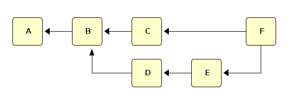
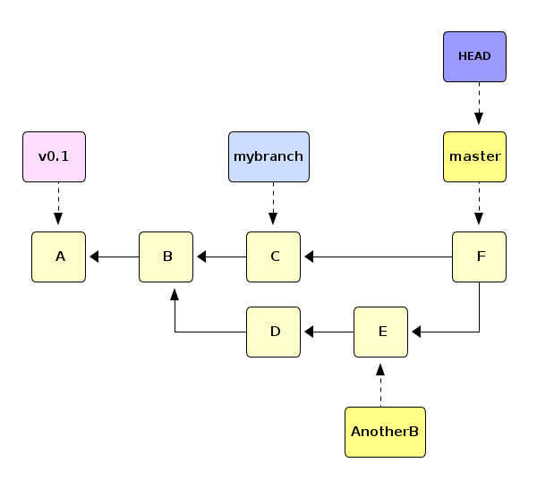
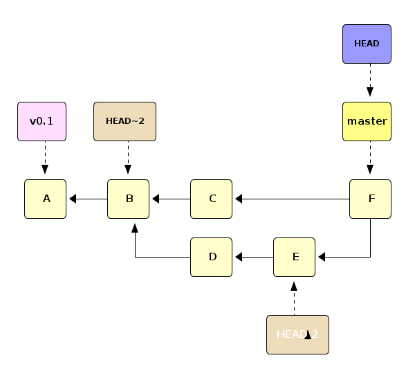
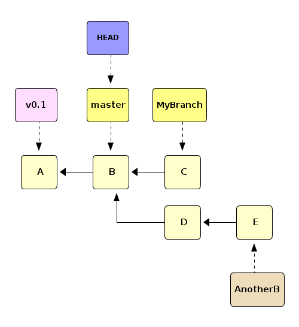
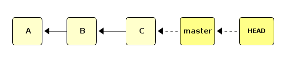
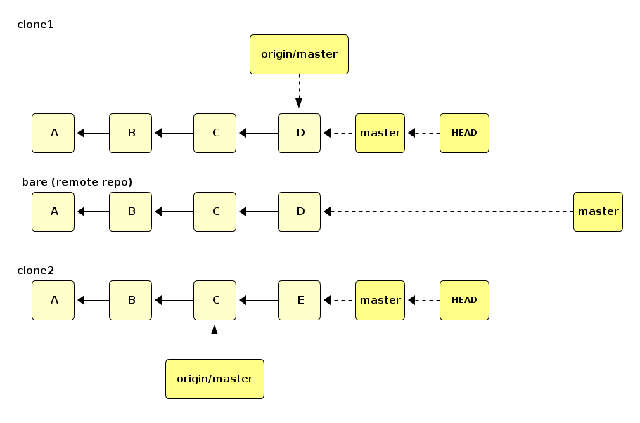
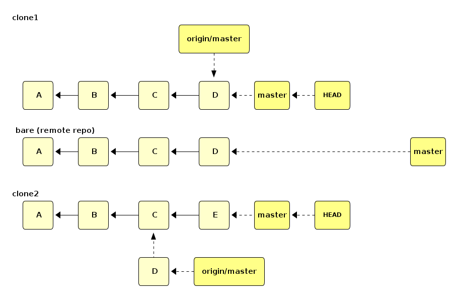

Some Good Software Development Practices
========================================

Version Control System
----------------------

THIS NEEDS BASH KERNEL, REMEMBER TO CHANGE FROM MENU

-   we will use `git` throughout this course as it is the industry standard; others exist
-   git is a distributed and decentralised version control system

### Of All Good Practices, Version Control Is The Most Important

-   Always a good thing to consider doing things in a distributed and decentralised way
    -   it will scale to just about any size you can think of (sometimes needs a small extra effort)
    -   opens door to not just industrial best practices, peer-to-peer software ideas, and some very important coding styles in industry but also to solving very large scale (numerical) problems in science
    -   do it even if you're working alone on a single computer: `git init .` or equivalent in other systems is not hard to do
    -   regular commits help you even when there are no other developers
    -   and it gets you to the habit

### Version Control System

-   tracks and provides control over changes to the project (source code in most cases)
-   enables to check when, why and by whom the given change was introduced (especially useful in hunting down bugs where something used to work before)
-   simplify simultaneous work on different features
-   simplify collaboration with other people
    -   know who changed what and when
    -   can usually automatically incorporate other people's changes to yours
    -   ability to pick only some edits by other people instead of all of them

### git Building Blocks

#### A commit

-   Snapshot of the state of project when the given (set of) change(s) was introduced together with metadata
    -   date
    -   author
    -   committer
    -   commit message which should briefly explain the change(s) made after previous commit
    -   list of parents (can be more than one or even zero)

#### A git repository (or just repo)

-   Simply a list of commits
-   Represented by a DAG: Directed Acyclic Graph
-   Let A...F be commits, the DAG could then be e.g.



#### A branch

-   a separate (independent) line of development in the same repo
-   technically, branch is just a nickname for a commit which gets moved to new commits as they are made
-   the `master` branch always exists; our example repo also has a branch called `mybranch`
-   current branch has a special pointer `HEAD` pointing to it (usually to the newest commit)
-   any commit can have a *tag* permanently attached to it
    -   often released versions of code would have a tag
    -   or the version used for a particular article
-   git also remembers the state of the branch on a remote (another distributed copy of the project)



### git Working with Repositories

#### Specifying a particular commit

-   `HEAD` means the current commit on the current branch (usually the chronologically latest)
-   a string like `92db05f2a784fe0a715de29fc97172eac6bb5089` is an sha1 hash of a commit, supposedly unique
-   name of a branch (master, mybranch, ...)
-   a tag, like `v0.1`
-   `rev^` refers to the parent of `rev`, `rev^1`, `rev^2` etc refer to next parents
-   `rev~n` refers to the nth ancestor of `rev`
-   in the diagram, we've now hidden some of the labels which still exist



#### Specifying Ranges of Commits

-   `rev` means all ancestors of `rev`
-   `--all` means all
-   `rev1..rev2` means commits reachable from `rev2` but not from `rev1`
    -   in our diagram `D..F` would mean just `C`
-   `rev1..` is a short for `rev1..HEAD`, i.e. from current commit all the way to `rev1` but not further

#### Merge

-   Merge happens when two distributed copies both have made changes and one attempts to combine them
-   Let's create a repository and initialise it to a known state
-   first just initialise it

``` bash
DIR=$(mktemp --directory ./git-repo-XXXXXXXX)
cd ${DIR}
git init .
```

-   start adding files, first one file and the `v0.1` tag

``` bash
echo 'Our file has initially this content' > my_file.txt
git add my_file.txt
git commit --message='Initial commit of version 0.1'
git tag --annotate \
--message='This tags the HEAD as version 0.1 with tag name v0.1' 'v0.1'
```

-   then we edit the file and add another, this becomes the "B" in our graph

``` bash
sed --in-place 's/has initially/now has/' my_file.txt
echo 'We also now have another file here' > my_second_file.txt
git add my_second_file.txt
git commit --all --message='Added my_second_file.txt and edited my_file.txt to reflect the current state'
```

-   create the new `MyBranch` branch and switch to it

``` bash
git branch MyBranch
git checkout MyBranch
```

-   add a file to the new branch

``` bash
echo 'This file only exists on MyBranch' > file_on_MyBranch.txt
git add file_on_MyBranch.txt
git commit --all \
--message='Created a new branch called MyBranch and added file_on_MyBranch.txt'
```

-   switch back to `master` (you could branch from `MyBranch` again, but that's not what our graph looks like) and create `AnotherB`

``` bash
git checkout master
git branch AnotherB
git checkout AnotherB
```

-   edit `my_file.txt` on `AnotherB` (elsewhere its contents are unchanged)

``` bash
sed --in-place 's/now has this content/has different content on AnotherB/' my_file.txt
git add my_file.txt
git commit --message='Edited my_file.txt to reflect the state on current branch'
```

-   add a new file to this branch

``` bash
echo 'A completely new file on AnotherB' > file_on_AnotherB.txt
git add file_on_AnotherB.txt
git commit --message='Added file_on_AnotherB.txt'
```

-   go back to master: no changes to contents but this is needed to move `HEAD` where it is in the graph

``` bash
git checkout master
```

-   We now have the following state



-   suppose you want to incorporate `MyBranch` to `master` now
    -   it does not matter who made the changes in `MyBranch`
-   while on `master` run `git merge MyBranch`

``` bash
git merge MyBranch
```

-   this is called a *Fast-Forward* merge (all changes are on the branch)
-   merging `AnotherB` is not a FF merge, as it might have conflicts from edits on different branches
    -   conflicts need to be handled manually and probably in consultation with other authors
-   this calls for a new commit, a commit with two parents

``` bash
git merge --no-edit AnotherB
```

-   this is the final state of the repo

### Working with remote repositories

-   in "git" the word "remote" means "not in this directory"
    -   typically "remote" is "in the cloud"
    -   but could be on the same computer as "local"
    -   we'll set up examples later
-   remotes are useful, almost required, when working with collaborator(s)
    -   all collaborators have their own local copy
    -   changes are merged either using a central remote copy (a "bare" repo with no local copy) or directly from a local copy to another
        -   the first method is somewhat contraty to git's distributed, decentralised nature but very widely used because
            -   there's nothing special about this central repo: it's just a bare repo of which there could be many
            -   it contains no extra data over an up-to-date clone and can be recreated from any such clone
            -   but it **is** the designated forum on which to collaborate and exchange commits
            -   but as any master-slaves system it does not scale, although the scaling limit is probably in the millions of concurrent developers in a single repo
        -   the latter method requires direct access to each other's local repos, which is often hard to arrange
        -   a third method involves sending patches, but don't go that route

### A Clone

-   unless you are the person setting up the repo with \`git init\`, the first thing to do is usually to *clone* an existing repo:

``` bash
DIR=$(uuidgen)
mkdir ${DIR}
cd ${DIR}
mkdir foo
cd foo
git init .
touch A
git add A
git commit --message="First commit: commit A"
touch B
git add B
git commit --message="Second commit: commit B"
echo "line already present: commit C" > C
git add C
git commit --message="this becomes the common ancestor"
cd ..
mkdir origin
cd origin
git init --bare .
cd ../foo/
git push ../origin/ master
cd ..
rm -rf foo
mkdir clones
cd clones/
```

``` bash
git clone ../origin/ clone1
```

which will place a copy (*clone*) of the requested repository in the current directory

-   this is what our repo (and our clone) looks like



-   suppose a collaborator has also cloned it
    -   these are now in the same directory tree, but merges only care about commit IDs so everything below works exactly the same if the clones are on different machines, cities, planets
    -   obviously, any merge will need to be able the "reach" both its commits, but again, that's regardless of where the clones or the repos are

``` bash
git clone ../origin/ clone2
```

-   at this point, this is what our directory tree looks like

``` bash
find |grep -v /.git
```

-   suppose changes are made and pushed back into the origin repo in both `clone1` and `clone2`

``` bash
cd clone1
echo "collaborator 1 has added this" >> C
cat C
touch D
git add C D
git commit --message="modified C, added D: commit D"
cd ../clone2
sed --in-place 's/\(.*\)/collaborator 2 added this\n\1/' C
cat C
touch E
git add C E
git commit --message="modified C, added E: commit E"
cd ../clone1
git push
cd ../clone2
```

-   we cannot push `clone2` now because our collaborator has pushed changes we are not up to date with `origin`
-   this is what we have now



-   the reason we cannot push is the existence of `D` in origin: if our collaborator had not pushed their commit `D` into origin, we would be able to push
    -   and indeed turn the tables, **they** did that when they pushed
-   this is **not** a fast-forward merge since we both have modified file `C`
-   the procedure is
    1.  fetch
    2.  diff
    3.  merge
-   if you are confident there are no conflicts, a `git pull` will do all of this but conflicts prevent it from committing at the end of merge, so generally best to do the above so you get a view of the changes

``` bash
git fetch
git diff FETCH_HEAD
```

-   the name `FETCH_HEAD` is exactly what you think: the HEAD of whatever was fetched, in this case `D`



-   the diff also shows there are no conflicts, so we can

``` bash
git merge --no-edit FETCH_HEAD
```

-   now we can push again

``` bash
git push
```

-   but collaborator 1 does not know of collaborator 2's changes before they pull in turn
    -   this is a fast forward as we have no unpushed commits

``` bash
cd ../clone1
git pull
```

-   and everything is up to date and all collaborators are happy
-   there is `git merge --abort` when you unexpectedly landed in a conflicted state and don't know what to do

### Conflicts

-   this is a bit too wide a topic to deal with here
-   and often involves peer-to-peer interaction to sort out whose changes are the right ones
-   to resolve a conflict, you need to
    1.  make sure no &lt; &lt; &lt; &lt; &lt; &lt; &lt;, = = = = = = =, or &gt; &gt; &gt; &gt; &gt; &gt; &gt; remain in the file you want to commit
    2.  commit it

#### *Evil Merge*

-   sometimes a merge will succeed without conflicts but **the contents are wrong**: an evil merge gives no warning that something might be amiss
    -   for example, suppose you are developing a code which needs to calculate


$$\begin{equation}
1-\frac{1}{2}x^2+\frac{1}{24}x^4
\end{equation}$$

a lot

-   you have just added a new option to the code which produces a visualisation of some results, i.e. nothing to do with calculating cos or the three first terms of its Taylor expansion
-   your collaborator, meanwhile, edits the Taylor expansion routine to just compute the first two terms because his profiling (later in the course) had revealed the increase in precision does not warrant the increasein runtime
-   after a successful, non-conflicted merge, your results will not be what you expected!
-   *Evil Merge* changed your results or even broke your program but caused no conflicts
-   can also happen with conflicts when the evil bit is not the conflicting one
-   if "evil" happens in the conflicting bit the reviewer (merger) is supposed to notice, and has at least been warned
-   one of our exercises is designed to produce a high likelihood of an evil merge, so watch out

### Exercises

#### Get up-to-date course notes

1.  Go to the Azure host: `ssh <yourusername>@slurmcluster01.westeurope.cloudapp.azure.com`.
2.  Still on the Azure host, change the working directory to `/share/data/<yourusername>`
3.  Clone the course repo in this directory
    1.  Do the next part of the exercise on the next lecture, it will be pointless right now

4.  In the directory you cloned the repo to, get the latest versions of the notes from the remote repo.
    1.  If you viewed the `.md` files using jupyter, you will get conflicts due to jupyter's autosave feature.
    2.  If you made any other changes, you may or may not get conflicts.
    3.  Probably the best way to deal with jupyter's autosave feature is to always checkout a new local branch and only ever update master from the remote. One way to do this is explained on the [course website](https://github.com/juhaj/damtp-research-programming).

5.  please clone the playground
    -   if you have a github account with ssh keypair set up, use `git clone git@github.com:juhaj/playground.git`
    -   if you don't, use `git clone https://github.com/juhaj/playground.git`

#### Comments about the exercises

1.  Save yourself from unnecessary trouble and add, commit, and push each file and change separately
2.  Carefully read strange messages from `git`: it may complain about changed defaults, about unset email settings and such, but these have no effect on the actual operation so can be ignored here
3.  You can use `git status` and `git show remote origin` to see what your and remote repos look like before you try yo push
4.  Whenever `git` refuses the changes you push to the remote repo it means you need to fetch and merge first
5.  When you have a conflict, you need to open the file in an editor, edit the contents so that they are "correct": there is no algorithm, this is where you talk to your collaborators and use human decision making skills to decide the correct content
6.  When your file has the desired content, you `git add FILE` to tell `git` you have resolved the conflict and then `git commit --message=something` to commit your changes (the resolved conflicting merge)
7.  Try to push again, but someone might have beaten you to it!

#### Add yourself to `AUTHORS`

-   You have just joined the project, so you need to add yourself to the AUTHORS file
-   the project has a policy that each author is on a separate line
    -   if we're lucky, this avoids conflicts as everyone does this about the same time
-   remember always to `git add` your edited file
-   now `git commit` with a sensible commit message
-   and `git push`

#### Update `README`

-   the `README` file mentions the number of authors the project has
-   update it to reflect current status
-   note that the number may be wrong by more than one!
    -   someone else might have forgotten to update it
    -   someone else might have updated and pushed `AUTHORS` already, but not yet `README`
-   remember the commit message again when you commit
-   be prepared for conflicts and try to push
    -   since we have many people working on this at the same time, you may get a conflict
    -   so better follow the above procedure if push fails

#### Update `Changelog`

-   typically projects have changelogs which have a static format but if it is not obvious what it should be here, don't worry, just add a list of changes, time, date, your email etc in it
-   add and commit with a sensible message
