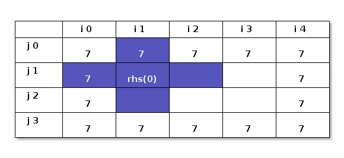

Prototyping Parallel Programs Using Python
==========================================

Maximum of the Gradient Using PETSc
-----------------------------------

-   nearly always a good idea to use a well written library to
    -   speed up development
    -   avoid bugs, especially in parts which are of only peripheral interest
    -   guarantee scalability of the algorithms, framework, implementation etc
        -   may still not scale due to the bits you write yourself, but at least that's easier to fix

### Maximum of Gradient Revisited

-   First some boilerplate which just imports necessary packages and initialises those which need initialisation (the handle initialisations happen on the `from ...` lines)

``` {.python}
  from __future__ import division
  import sys
  import time
  import numpy
  import mpi4py
  from mpi4py import MPI
  import petsc4py
  petsc4py.init(sys.argv)
  from petsc4py import PETSc
  import cProfile
```

-   Next we need to set up some infrastructure: `PETSc.DMDA` is the most basic distributed data manager and its `StencilType` and `BoundaryType` attributes just define what shape region around a grid point is needed to compute whatever we want to compute at that point (options are `BOX` and `STAR`); `ssize` will become the size of this stencil later.

``` {.python}
  stype = PETSc.DMDA.StencilType.BOX
  ssize = 1
```

-   Boundaries of the lattice can be `NONE`, `GHOSTED`, or `PERIODIC`; `GHOSTED` means the ghost points exist on the external boundary, too. Those can be used to store boundary conditions. With `NONE` you need to special case the exterior boundary.

``` {.python}
  bx    = PETSc.DMDA.BoundaryType.PERIODIC
  by    = PETSc.DMDA.BoundaryType.PERIODIC
  bz    = PETSc.DMDA.BoundaryType.PERIODIC
```

-   We will have a look at MPI later, but with PETSc you rarely need any explicit MPI. For these examples, this is the only thing you need: the "name" of the MPI world we want to work in. For PETSc the top-level code almost invariably uses `PETSc.COMM_WORLD`.

``` {.python}
  comm = PETSc.COMM_WORLD
```

-   PETSc handles those pesky things called command line parameters (and configuration files!) for us, too. Let's see if we have been passed

=m=, `n`, or `p`.

``` {.python}
  OptDB = PETSc.Options() #get PETSc option DB
  m = OptDB.getInt('m', PETSc.DECIDE)
  n = OptDB.getInt('n', PETSc.DECIDE)
  p = OptDB.getInt('p', PETSc.DECIDE)
```

-   This creates the distributed manager. Note how our variables above get used. There's one we did not explain: `dof` is simply the number of degrees of freedom (number of unknowns) per lattice site. The negative `sizes` values tells PETSc to get the value from command line parameters `-da_grid_x M`, `-da_grid_y N`, and `-da_grid_z P`, or use the magnitudes of the supplied parameter `sizes` if the corresponding cmdline one cannot be found. The latter two method calls handle the command line bit.
-   Note that this is not the shortest possible code: all the above lines can be omitted and defaults used in the `PETSc.DMDA().create()` call
    -   it is instructive to see how to write a **useful** program instead of simplest possible example

``` {.python}
  dm = PETSc.DMDA().create(dim=3, sizes = (-3,-8,-10), proc_sizes=(m,n,p),
                           boundary_type=(bx,by,bz), stencil_type=stype,
                           stencil_width = ssize, dof = 1, comm = comm, setup = False)
  dm.setFromOptions()
  dm.setUp()
```

-   We have yet to allocate our "big data", so let's do that: the variable to hold our data
    -   this is a "vector" spanning all our workers
    -   it uses the `dm` we just created to figure out the neighbours, dimensions etc

``` {.python}
  data = dm.createGlobalVector()
```

-   At this stage we can start thinking about our problem; we borrow heavily from the example in the MPI lecture so no comments here

``` {.python}
  def initialise(dm, field):
      field_ = dm.getVecArray(field)
      (zs, ze), (ys, ye), (xs, xe) = dm.getRanges()
      procsalong = dm.getProcSizes()
      for z in xrange(zs,ze):
          for y in xrange(ys,ye):
              start = xs + (xe-xs)*(y)*procsalong[2] + (ye-ys)*(xe-xs)*(z)*procsalong[1]*procsalong[2]
              stop = start + (xe-xs)
              field_[z,y,:] = numpy.arange(start, stop, step=1)**2
      return
```

-   That isn't much simpler than pure MPI because we have funny map from grid coordinate to data value
-   But it did not require us to write any support code unlike pure MPI
-   Define a function to compute the gradients

``` {.python}
  def compute_grad(dm, field, dmgrad, grad):
      local_field = dm.createLocalVector()
      dm.globalToLocal(field, local_field)
      field_array = dm.getVecArray(local_field)
      grad_array = dmgrad.getVecArray(grad)
      temp=numpy.array(numpy.gradient(field_array[:]))[:,1:-1,1:-1,1:-1]
      gradients=numpy.zeros(temp.shape[1:]+(temp.shape[0],))
      for coo in [0,1,2]:
          gradients[:,:,:,coo] = temp[0][:,:,:]
      #grad[:]=numpy.array(numpy.gradient(field_array[:]))[:,1:-1,1:-1,1:-1].swapaxes(0,1).swapaxes(1,2).swapaxes(2,3)
      grad_array[:] = gradients[:,:,:,:]
```

-   In a typical program `local_field` is not recreated every time it is needed, thus removing one line here
-   The ghost comms happens in the `dm.globalToLocal` method
-   Again, no extra setup of datatypes or communication routines is necessary
-   Since PETSc handles our data, we cannot simply grow our numpy array like in pure MPI example but need to create a PETSc data structure for our gradients
    -   this could be done in other several ways, too

``` {.python}
  dmgrad = PETSc.DMDA().create(dim=3, sizes = dm.sizes, proc_sizes=dm.proc_sizes,
                           boundary_type=(bx,by,bz), stencil_type=stype,
                           stencil_width = ssize, dof = 3, comm = comm, setup = False)
  dmgrad.setFromOptions()
  dmgrad.setUp()
  grads = dmgrad.createGlobalVector()
```

-   Then the actual work:
    -   Initialise
    -   Compoute gradients
    -   Find the maximum:

``` {.python}
  initialise(dm, data)
  compute_grad(dm, data, dmgrad, grads)
  maxgrad=grads.norm(PETSc.NormType.INFINITY)
  if PETSc.COMM_WORLD.rank == 0:
      print("Global maximum of the gradient was {maxgrad}.".format(maxgrad=maxgrad))
```

-   This is available in the `codes/python` directory: go and try to run it with `mpirun -np 4` to double check the result is the same.

Linear Solves
-------------

### Direct Solve

``` {.example}
These *should* work but *don't*
- Poisson equation \( \nabla^2 \phi(x,y) - g(x,y) = 0 \)
- Poisson equation \[ \nabla^2 \phi(x,y) - g(x,y) = 0 \]
- Poisson equation 
\[ \nabla^2 \phi(x,y) - g(x,y) = 0 \]
```

-   Poisson equation

\begin{equation}
\nabla^2 \phi(x,y) - g(x,y) = 0
\end{equation}

-   Direct Solve is \$ O((Nx\*Ny)<sup>3</sup>) \$ complexity, so be careful
-   It also needs \( O((Nx*Ny)^2) \) of storage!
-   Let's see what the code looks like.

``` {.python}
  from __future__ import division
  import sys
  import time
  import numpy
  import mpi4py
  from mpi4py import MPI
  import petsc4py
  petsc4py.init(sys.argv)
  from petsc4py import PETSc
  import cProfile
```

-   Next we need to set up some infrastructure: `PETSc.DMDA` is the most basic distributed data manager and its `StencilType` and `BoundaryType` attributes just define what shape region around a grid point is needed to compute whatever we want to compute at that point (options are `BOX` and `STAR`); `ssize` will become the size of this stencil later.

``` {.python}
  stype = PETSc.DMDA.StencilType.BOX
  ssize = 1
```

-   Boundaries of the lattice can be `NONE`, `GHOSTED`, or `PERIODIC`; `GHOSTED` means the ghost points exist on the external boundary, too. Those can be used to store boundary conditions. With `NONE` you need to special case the exterior boundary.

``` {.python}
  bx    = PETSc.DMDA.BoundaryType.GHOSTED
  by    = PETSc.DMDA.BoundaryType.GHOSTED
  bz    = PETSc.DMDA.BoundaryType.GHOSTED
```

-   We will have a look at MPI later, but with PETSc you rarely need any explicit MPI. For these examples, this is the only thing you need: the "name" of the MPI world we want to work in. For PETSc the top-level code almost invariably uses `PETSc.COMM_WORLD`.

``` {.python}
  comm = PETSc.COMM_WORLD
```

-   PETSc handles those pesky things called command line parameters (and configuration files!) for us, too. Let's see if we have been passed

=m=, `n`, or `p`.

``` {.python}
  OptDB = PETSc.Options() #get PETSc option DB
  m = OptDB.getInt('m', PETSc.DECIDE)
  n = OptDB.getInt('n', PETSc.DECIDE)
  p = OptDB.getInt('p', PETSc.DECIDE)
```

-   This creates the distributed manager. Note how our variables above get used. There's one we did not explain: `dof` is simply the number of degrees of freedom (number of unknowns) per lattice site. The negative `sizes` values tells PETSc to get the value from command line parameters `-da_grid_x M`, `-da_grid_y N`, and `-da_grid_z P`, or use the magnitudes of the supplied parameter `sizes` if the corresponding cmdline one cannot be found. The latter two method calls handle the command line bit.

``` {.python}
  dm = PETSc.DMDA().create(dim=3, sizes = (-11,-7,-5), proc_sizes=(m,n,p),
                           boundary_type=(bx,by,bz), stencil_type=stype,
                           stencil_width = ssize, dof = 1, comm = comm, setup = False)
  dm.setFromOptions()
  dm.setUp()
```

-   At this stage we need to define our physics. We use the Poisson equation here, but any linear boundary value PDE would work. Obviously, initial value problems must be dealt differently.
-   Comments on the code

    `__init__()`  
    -   called when class is instantiated; it just saves given lattice spacings `dx`, `dy`, `dz`; and creates a data structure `self.g` for the RHS.

    `rhs()`  
    -   the call to `self.dm.getVecArray()` is PETSc's most useful call: the returned data structure is a numpy array, indexable in almost the normal fashion with distributed-global indices
        -   almost: index `array[-1]` is not last element, but "left of 0": the first ghost element to the "left of 0"
    -   we specify the value of `self.g` here simply as all ones, could be anything (as long as linear);
    -   the `rhs_array` will gets its values in the usual fashion from 7-point Laplacian stencil
    -   `self.dm.getRanges()` returns the distributed-local ranges of the lattice coordinates currect rank has
    -   `self.dm.getSizes()` gives the distributed-global sizes of the lattice: needed in the loop for detecting when to apply boundary conditions
    -   finally, a very inefficient loop setting the values: for most lattice points it is a `rhs_array[i,j,k] ` rhs<sub>array</sub>[i,j,k]= but this is only ran once, so not too important
    -   the non-trivial values are the boundary conditions (i.e. u=7), see plot

        

    `compute_operators()`  
    -   dealing with distributed matrices almost always starts with `A.zeroEntries()` and ends with `A.assemble()`
    -   `PETSc.Mat.Stencil()` returns a convenient helper object to deal with setting sparse matrix values simply by using the lattice coordinates instead of tranaforming them to matrix indices
        -   sparse values cannot be set using normal `[]` type indexing
        -   slight performance penalty but again we do this just once
    -   the `for index,value` loop goes over the indices of all non-zero entries on the current row and sets the values of the corresponding elements
    -   `row.index` and `col.index` are used to calculate the matrix indices from lattice indices; `row.field` and `col.field` refer to which degree of freedom these values apply to in said conversion (the `dof` in the `PETSc.DMDA().create()`)
    -   finally, `A.setValueStencil()` puts the values in

``` {.python}
  class poisson(object):
      def __init__(self, dm, dx_i):
          self.dm = dm
          self.dx = dx_i["dx"]
          self.dy = dx_i["dy"]
          self.dz = dx_i["dz"]
          self.g = self.dm.createGlobalVector()

      def rhs(self, ksp, rhs):
          dx,dy,dz=self.dx,self.dy,self.dz
          rhs_array = self.dm.getVecArray(rhs)
          g_ = self.dm.getVecArray(self.g)
          g_[:] = 1.0 
          rhs_array[:]=g_[:]*numpy.ones_like(rhs_array)*dx*dy*dz
          (xs, xe), (ys, ye), (zs, ze) = self.dm.getRanges()
          mx,my,mz = self.dm.getSizes()
          for k in range(zs, ze):
              for j in range(ys, ye):
                  for i in range(xs, xe):
                          rhs_array[i,j,k] = (rhs_array[i,j,k] +
                                              7.0*(((k==0) + (k==mz-1))*dx*dy/dz +
                                                   ((j==0) + (j==my-1))*dx*dz/dy +
                                                   ((i==0) + (i==mx-1))*dy*dz/dx))
          return

      def compute_operators(self, ksp, J, A):
          A.zeroEntries()
          row = PETSc.Mat.Stencil()
          col = PETSc.Mat.Stencil()
          (xs, xe), (ys, ye), (zs, ze) = self.dm.getRanges()
          dx,dy,dz=self.dx,self.dy,self.dz
          for k in range(zs, ze):
              for j in range(ys, ye):
                  for i in range(xs, xe):
                      row.index = (i,j,k)
                      row.field = 0
                      diag = -2.0*(dx*dy/dz+dx*dz/dy+dy*dz/dx)
                      for index, value in [
                              ((i,j,k-1), +1.0/dz*dx*dy),
                              ((i,j-1,k), +1.0/dy*dx*dz),
                              ((i-1,j,k), +1.0/dx*dy*dz),
                              ((i, j, k), diag),
                              ((i+1,j,k), +1.0/dx*dy*dz),
                              ((i,j+1,k), +1.0/dy*dx*dz),
                              ((i,j,k+1), +1.0/dz*dx*dy)]:
                          col.index = index
                          col.field = 0
                          A.setValueStencil(row, col, value)
          A.assemble()
          return None
  poisson_problem = poisson(dm, {"dx":0.1, "dy":0.1, "dz":0.1})
```

-   Now we are ready to set up the solver. First we create a KSP solver,

``` {.python}
  ksp = PETSc.KSP().create()
```

-   tell it that we are working with a distributed manager (`ksp.setDM()`),

``` {.python}
  ksp.setDM(dm)
```

-   then tell the solver how to generate the RHS and matrix

``` {.python}
  ksp.setComputeRHS(poisson_problem.rhs)
  ksp.setComputeOperators(poisson_problem.compute_operators)
```

-   and finally finish the setup by accommodating all configuration file and command-line options

``` {.python}
  ksp.setFromOptions()
```

-   the defaults are "GMRES" and "ILU", which combined gives an iterative method; we want a direct solve
    -   but `LU` is uniprocessor so multirank versions must be ran with something else

``` {.python}
  if (comm.size <= 1):
      if not(OptDB.hasName("ksp_type")):
          ksp.setType(PETSc.KSP().Type.PREONLY)
      if not(OptDB.hasName("pc_type")):
          ksp.getPC().setType(PETSc.PC().Type.LU)
  else:
      if not(OptDB.hasName("ksp_type")):
          ksp.setType(PETSc.KSP().Type.GMRES)
      if not(OptDB.hasName("pc_type")):
          ksp.getPC().setType(PETSc.PC().Type.BJACOBI)
```

-   Before we can solve the problem we need a workspace (`sol`) and an initial guess (`field`), which we just leave uninitialised now: for a KSP solver, that of course affects convergence speed but unlike Newton algorithms, it makes no difference otherwise: the inverse of the matrix is unique when it exists.

``` {.python}
  field = dm.createGlobalVector()
  sol = field.duplicate()
```

-   The solver would now normally be invoked with `ksp.solve(field,sol)` but we wrap this in python's built-in profiler to get some information of the efficiency of the code and where is spends its time: `time.clock()` just gives the CPU time used since either the beginning of the process and `cProfile.run()` sets up profiling and then gives its parameter to `exec` and outputs statistics after that finishes (i.e. in this case after divergence or convergence).

``` {.python}
  start = time.clock()
  cProfile.run("ksp.solve(field,sol)", sort="time")
  end = time.clock()
```

-   Now we can have a look at the solution; we will later see how we could visualise this. The code in the git repo has a rudimentary visualiser built in.

``` {.python}
  ksp.getSolution()[:]
```

-   That program was actually ran in an MPI distributed parallel fashion, PETSc just hides almost all of it. The only hints of MPI are in the *LocalVector* and *COMM<sub>WORLD</sub>* names. In this case, it ran with just one processor core, for reasons of interactive python. We can run a proper 8-way-parallel (8 *ranks*) quite easily, though: all we need is a "magic" string `%%bash` in our code below. First `git` checks out the correct version of the training codebase and then mpirun executes the code with 8 ranks. Finally it reverts back to master branch.

``` {.bash}
  %%bash
  mpirun -np 8 python -- ../codes/python/poisson_ksp.py -da_grid_x 40 -da_grid_y 30 -da_grid_z 20
```

### Iterative Solver

-   PETSc's Krylov SPace (KSP) solvers are in principle iterative KSP solvers
    -   this avoids matrix inversion, which is an \(O(N^2.8)\) operation (Strassen; Coppersmith-Winograd is \(O(N^2.373)\) but not know to been ever implemented --- in fact Strassen is not used in practice either)
    -   iterative KSP solvers get away with iterating matrix-vector only, which is \(O(N^2)\)
    -   one thus hopes KSP solver does not take too many iterations compared to (iterative) inversion
    -   iterative is also numerically more stable and more accurate, so never any point in direct inversion
    -   our trick above was to use "LU" as the preconditioner: that preconditoiner actually *solves* the system, leaving the KSP iterative part unemployed (hence we could use "PREONLY")
-   so what does this look like as an iterative solver?
    -   since we process command line options on line `ksp.setFromOptions()` all we need to do is pass the correct parameters
    -   `-ksp_type gmres` is the default and actually very good, so we'll use that
    -   `-pc_type ilu` is also the default, not necessarily the best but there are dozens to choose from and the best is problem dependent, so we use the default here, too
    -   note there is *no need* to alter the source code *at all*

``` {.bash}
  %%bash
  mpirun -np 8 python -- ../codes/python/poisson_ksp.py -da_grid_x 40 -da_grid_y 30 -da_grid_z 20 -ksp_type gmres -pc_type bjacobi
```

-   Next we forget about linearity and use non-linear solvers; for familiarity and emphasising the small differences we first solve \(\nabla^2 \phi(x,y) - g(x,y) = 0\) and then an actual non-linear equation

Non-Linear Iterative Poisson Solver
-----------------------------------

### Poisson Equation using a non-linear solver (PETSc SNES)

-   we do not really need to import these again in the jupyter kernel, but we are actually generating source codes in `codes/python` from this file so we need to repeat this here

``` {.python}
  from __future__ import division
  import sys
  import time
  import numpy
  import mpi4py
  from mpi4py import MPI
  import petsc4py
  petsc4py.init(sys.argv)
  from petsc4py import PETSc
```

-   The Poisson class looks very familiar
    -   note that in `FormLaplacian` the RHS function g (or `self.g`) does not contribute as it is independent of our unknowns
    -   we use the outside ghost points to hold boundary values (not most efficient but not bad and simplest code)

``` {.python}
  class poisson(object):
      def __init__(self, dm, dx_i):
          self.dm = dm
          self.dx = dx_i["dx"]
          self.dy = dx_i["dy"]
          self.dz = dx_i["dz"]
          self.local_field = self.dm.createLocalVector()
          self.g = self.dm.createGlobalVector()
      @property
      def stencil_width(self):
          return self.dm.getStencilWidth()
      def create_initial_guess(self, field):
          field_ = self.dm.getVecArray(field)
          g_ = self.dm.getVecArray(self.g)
          field_[:] = numpy.random.random(field_.shape)
          g_[:] = numpy.ones_like(field_)
          lf = self.dm.getVecArray(self.local_field)
          lf[:,:,:]=-7.0
      def monitor(self, snes, iter, fnorm):
          sol = snes.getSolution()
          field_array = self.dm.getVecArray(sol)
      def rhs(self, snes, field, rhs):
          self.dm.globalToLocal(field, self.local_field)
          field_array = self.dm.getVecArray(self.local_field)
          rhs_array = self.dm.getVecArray(rhs)
          rhs_array[:]=0
          g_ = self.dm.getVecArray(self.g)
          (xs, xe), (ys, ye), (zs, ze) = self.dm.getRanges()
          dx,dy,dz=self.dx,self.dy,self.dz
          lapl = (
              (field_array[xs-1:xe-1,ys:ye,zs:ze]-2*field_array[xs:xe,ys:ye,zs:ze]
               +field_array[xs+1:xe+1,ys:ye,zs:ze])/dx*dy*dz +
              (field_array[xs:xe,ys-1:ye-1,zs:ze]-2*field_array[xs:xe,ys:ye,zs:ze]
               +field_array[xs:xe,ys+1:ye+1,zs:ze])/dy*dx*dz +
              (field_array[xs:xe,ys:ye,zs-1:ze-1]-2*field_array[xs:xe,ys:ye,zs:ze]
               +field_array[xs:xe,ys:ye,zs+1:ze+1])/dz*dx*dy)
          rhs_array[:] = lapl[:,:,:] - g_[:,:,:]*dx*dy*dz
          return
      def formJacobian(self, snes, X, J, P):
          self.dm.globalToLocal(X, self.local_field)
          field_array = self.dm.getVecArray(self.local_field)
          P.zeroEntries()
          row = PETSc.Mat.Stencil()
          col = PETSc.Mat.Stencil()
          (xs, xe), (ys, ye), (zs, ze) = self.dm.getRanges()
          dx,dy,dz=self.dx,self.dy,self.dz
          for k in range(zs, ze):
              for j in range(ys, ye):
                  for i in range(xs, xe):
                      row.index = (i,j,k)
                      row.field = 0
                      u = field_array[i,j,k]
                      diag = -2.0*(dx*dy/dz+dx*dz/dy+dy*dz/dx)
                      for index, value in [
                              ((i,j,k-1), +1.0/dz*dx*dy),
                              ((i,j-1,k), +1.0/dy*dx*dz),
                              ((i-1,j,k), +1.0/dx*dy*dz),
                              ((i, j, k), diag),
                              ((i+1,j,k), +1.0/dx*dy*dz),
                              ((i,j+1,k), +1.0/dy*dx*dz),
                              ((i,j,k+1), +1.0/dz*dx*dy)]:
                          col.index = index
                          col.field = 0
                          P.setValueStencil(row, col, value)
          P.assemble()
          if (J != P):
              J.assemble() # matrix-free operator
          return PETSc.Mat.Structure.SAME_NONZERO_PATTERN
```

-   more familiar stuff

``` {.python}
  stype = PETSc.DMDA.StencilType.BOX
  bx    = PETSc.DMDA.BoundaryType.GHOSTED
  by    = PETSc.DMDA.BoundaryType.GHOSTED
  bz    = PETSc.DMDA.BoundaryType.GHOSTED
  comm = PETSc.COMM_WORLD
  rank = comm.rank
  OptDB = PETSc.Options() #get PETSc option DB
  #M = OptDB.getInt('M', 11)
  #N = OptDB.getInt('N', 7)
  #P = OptDB.getInt('P', 5)
  M,N,P = -11, -7, -5
  m = OptDB.getInt('m', PETSc.DECIDE)
  n = OptDB.getInt('n', PETSc.DECIDE)
  p = OptDB.getInt('p', PETSc.DECIDE)
  dm = PETSc.DMDA().create(dim=3, sizes = (M,N,P), proc_sizes=(m,n,p),
                           boundary_type=(bx,by,bz), stencil_type=stype,
                           stencil_width = 1, dof = 1, comm = comm, setup = False)
  dm.setFromOptions()
  dm.setUp()
```

-   instanciate the Poisson class

``` {.python}
  poisson_problem = poisson(dm, {"dx":0.1, "dy":0.1, "dz":0.1})
```

-   prepare the initial conditions

``` {.python}
  rhs = dm.createGlobalVector()
```

-   set up the SNES solver: the `setMonitor` allows us to define a function to be called after each iteration (and before the first)

``` {.python}
  snes = PETSc.SNES().create()
  snes.setDM(dm)
  snes.setFunction(poisson_problem.rhs, rhs)
  snes.setMonitor(poisson_problem.monitor)
```

-   PETSc has too many options:
    -   `FD` means is skips our FromJacobian and estimates it using finite differences
    -   `MF` employs a matrix-free algorithm
    -   `FD Color` is another finite differencing method
    -   `MF Operator` is another matrix-free method
-   we just sort the various options here
-   Exercise: compare the speeds of the various methods

``` {.python}
  if (OptDB.hasName("snes_mf")):
      mf=OptDB.getBool("snes_mf")
  else:
      mf=None
  if (OptDB.hasName("snes_fd")):
      fd=OptDB.getBool("snes_fd")
  else:
      fd=None
  if (OptDB.hasName("snes_mf_operator")):
      mfop=OptDB.getBool("snes_mf_operator")
  else:
      mfop=None
  if (OptDB.hasName("snes_fd_color")):
      fdcol=OptDB.getBool("snes_fd_color")
  else:
      # this actually defaults to True but we want to make sure we have a way of
      # using the hand-written Jacobian, too and we want that by default
      fdcol=None
  print("Using FD={fd}, MF={mf}, FD Color={fdcol}, MF Operator={mfop}".format(
      fd=fd, mf=mf, fdcol=fdcol, mfop=mfop))
  if not((mf) or (mfop) or (fd) or (fdcol)):
      # No option was given, default to hand-written Jacobian EVEN THOUGH PETSc's internal
      # default in this case is -fd_color 1
      print("Using hand-written Jacobian with a preconditioner {prec}.".format(prec=snes.getKSP().getPC().getType()))
      J = dm.createMatrix()
      snes.setJacobian(poisson_problem.formJacobian, J)
  elif (mf or mfop):
      if (fd or fdcol):
          raise ValueError("Cannot have both MF and FD at the same time.")
  elif (fd or fdcol or (fdcol==None)):
      # supplying no option means "-fd_color 1", so "fdcol==None" must be treated as
      # "fdcol==True"
      if (mf or mfop):
          raise ValueError("Cannot have both FD and MF at the same time.")
```

-   choose the KSP type: SNES uses KSP (by default in iterative mode) to solve the linear step of the non-linear solve

``` {.python}
  snes.getKSP().setType("cg")
```

-   process command line parameters line in KSP and create an initial guess to start from

``` {.python}
  snes.setFromOptions()
  field = dm.createGlobalVector()
  poisson_problem.create_initial_guess(field)
```

-   run

``` {.python}
  import cProfile
  start = time.clock()
  cProfile.run("snes.solve(None, field)")
  end = time.clock()
```

### Non-linear Poisson Equation using a non-linear solver (PETSc SNES)

-   We want to solve

\[
\nabla^2 f(x) - g(x) f(x)^2 = 0
\]

-   the only difference to the Poisson code is that now our RHS is non-linear and therefore a term like \( g f^2
       \) appears in RHS and the diagonal elements of the Jacobian have and extra term

``` {.python}
  from __future__ import division
  import sys
  import time
  import numpy
  import mpi4py
  from mpi4py import MPI
  import petsc4py
  petsc4py.init(sys.argv)
  from petsc4py import PETSc

  class nl_poisson(object):
      def __init__(self, dm, dx_i):
          self.dm = dm
          self.dx = dx_i["dx"]
          self.dy = dx_i["dy"]
          self.dz = dx_i["dz"]
          self.local_field = self.dm.createLocalVector()
          self.g = self.dm.createGlobalVector()
      @property
      def stencil_width(self):
          return self.dm.getStencilWidth()
      def create_initial_guess(self, field):
          field_ = self.dm.getVecArray(field)
          g_ = self.dm.getVecArray(self.g)
          field_[:] = numpy.random.random(field_.shape)
          g_[:] = numpy.ones_like(field_)
          lf = self.dm.getVecArray(self.local_field)
          lf[:,:,:]=-7.0
      def monitor(self, snes, iter, fnorm):
          sol = snes.getSolution()
          field_array = self.dm.getVecArray(sol)
      def rhs(self, snes, field, rhs):
          self.dm.globalToLocal(field, self.local_field)
          field_array = self.dm.getVecArray(self.local_field)
          rhs_array = self.dm.getVecArray(rhs)
          rhs_array[:]=0
          g_ = self.dm.getVecArray(self.g)
          (xs, xe), (ys, ye), (zs, ze) = self.dm.getRanges()
          dx,dy,dz=self.dx,self.dy,self.dz
          lapl = (
              (field_array[xs-1:xe-1,ys:ye,zs:ze]-2*field_array[xs:xe,ys:ye,zs:ze]
               +field_array[xs+1:xe+1,ys:ye,zs:ze])/dx*dy*dz +
              (field_array[xs:xe,ys-1:ye-1,zs:ze]-2*field_array[xs:xe,ys:ye,zs:ze]
               +field_array[xs:xe,ys+1:ye+1,zs:ze])/dy*dx*dz +
              (field_array[xs:xe,ys:ye,zs-1:ze-1]-2*field_array[xs:xe,ys:ye,zs:ze]
               +field_array[xs:xe,ys:ye,zs+1:ze+1])/dz*dx*dy)
          rhs_array[:] = (lapl[:,:,:] -
                          g_[:,:,:]*(field_array[xs:xe,ys:ye,zs:ze])**2*dx*dy*dz)
          return
      def formJacobian(self, snes, X, J, P):
          self.dm.globalToLocal(X, self.local_field)
          field_array = self.dm.getVecArray(self.local_field)
          g_ = self.dm.getVecArray(self.g)
          P.zeroEntries()
          row = PETSc.Mat.Stencil()
          col = PETSc.Mat.Stencil()
          (xs, xe), (ys, ye), (zs, ze) = self.dm.getRanges()
          dx,dy,dz=self.dx,self.dy,self.dz
          for k in range(zs, ze):
              for j in range(ys, ye):
                  for i in range(xs, xe):
                      row.index = (i,j,k)
                      row.field = 0
                      u = field_array[i,j,k]
                      diag = -2.0*(dx*dy/dz+dx*dz/dy+dy*dz/dx) - g_[i,j,k]*2*field_array[i,j,k]*dx*dy*dz
                      for index, value in [
                              ((i,j,k-1), +1.0/dz*dx*dy),
                              ((i,j-1,k), +1.0/dy*dx*dz),
                              ((i-1,j,k), +1.0/dx*dy*dz),
                              ((i, j, k), diag),
                              ((i+1,j,k), +1.0/dx*dy*dz),
                              ((i,j+1,k), +1.0/dy*dx*dz),
                              ((i,j,k+1), +1.0/dz*dx*dy)]:
                          col.index = index
                          col.field = 0
                          P.setValueStencil(row, col, value)
          P.assemble()
          if (J != P):
              J.assemble()
          return PETSc.Mat.Structure.SAME_NONZERO_PATTERN

  stype = PETSc.DMDA.StencilType.BOX
  bx    = PETSc.DMDA.BoundaryType.GHOSTED
  by    = PETSc.DMDA.BoundaryType.GHOSTED
  bz    = PETSc.DMDA.BoundaryType.GHOSTED
  comm = PETSc.COMM_WORLD
  rank = comm.rank
  OptDB = PETSc.Options()
  M,N,P = -11, -7, -5
  m = OptDB.getInt('m', PETSc.DECIDE)
  n = OptDB.getInt('n', PETSc.DECIDE)
  p = OptDB.getInt('p', PETSc.DECIDE)
  dm = PETSc.DMDA().create(dim=3, sizes = (M,N,P), proc_sizes=(m,n,p),
                           boundary_type=(bx,by,bz), stencil_type=stype,
                           stencil_width = 1, dof = 1, comm = comm, setup = False)
  dm.setFromOptions()
  dm.setUp()
  nl_poisson_problem = nl_poisson(dm, {"dx":0.1, "dy":0.1, "dz":0.1})
  rhs = dm.createGlobalVector()
  snes = PETSc.SNES().create()
  snes.setDM(dm)
  snes.setFunction(nl_poisson_problem.rhs, rhs)
  snes.setMonitor(nl_poisson_problem.monitor)
  if (OptDB.hasName("snes_mf")):
      mf=OptDB.getBool("snes_mf")
  else:
      mf=None
  if (OptDB.hasName("snes_fd")):
      fd=OptDB.getBool("snes_fd")
  else:
      fd=None
  if (OptDB.hasName("snes_mf_operator")):
      mfop=OptDB.getBool("snes_mf_operator")
  else:
      mfop=None
  if (OptDB.hasName("snes_fd_color")):
      fdcol=OptDB.getBool("snes_fd_color")
  else:
      fdcol=None
  print("Using FD={fd}, MF={mf}, FD Color={fdcol}, MF Operator={mfop}".format(
      fd=fd, mf=mf, fdcol=fdcol, mfop=mfop))
  if not((mf) or (mfop) or (fd) or (fdcol)):
      print("Using hand-written Jacobian with a preconditioner {prec}.".format(prec=snes.getKSP().getPC().getType()))
      J = dm.createMatrix()
      snes.setJacobian(nl_poisson_problem.formJacobian, J)
  elif (mf or mfop):
      if (fd or fdcol):
          raise ValueError("Cannot have both MF and FD at the same time.")
  elif (fd or fdcol or (fdcol==None)):
      if (mf or mfop):
          raise ValueError("Cannot have both FD and MF at the same time.")

  snes.getKSP().setType("cg")
  snes.setFromOptions()
  field = dm.createGlobalVector()
  nl_poisson_problem.create_initial_guess(field)
```

-   and finally run it (note how similar everything here is to the pure Poisson SNES code:
    -   you could refactor things and share everything but the rhs and Laplacian methods!

``` {.python}
  import cProfile
  start = time.clock()
  cProfile.run("snes.solve(None, field)")
  end = time.clock()
```

Time Stepping
-------------

-   Write a code using `PETSc.TS` to simulate

\[
\nabla^2 f(x) - g(x) f(x)^2 = \frac{d}{dt} f(x)
\]

