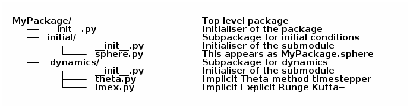

python
======

This is mostly based on the official [python tutorial](https://docs.python.org/3/tutorial/): reading the tutorial is highly recommended to make sure your python is up to speed.

Jupyter
-------

-   Some of you may have noticed I am using *jupyter* to display the notes. It is also available on the Maths desktops using the following commands
-   load the module environment for the course
    -   `export MODULEPATH=/alt/applic/modules/modulefiles-easybuild/all`
-   load the relevant modules:
    -   `module load petsc4py IPython ipyparallel matplotlib`
-   go to the directory where your copy of the course repository sits
-   `jupyter notebook --no-browser`
-   note
    -   you need to punch a hole in the firewall between CATAM and Maths if you want to use a browser on the CATAM machine to access this
    -   if you remove `--no-browser` from the command, it will try to send a browser window from Maths to CATAM
        -   it may work but even if it does, it may be unusably slow
    -   if sitting at the desktop, it works fine without `--no-browser` and of course there is no need to punch any holes

Data Structures: lists, tuples, dicts
-------------------------------------

-   list is just that: a list of things
    -   technically they are instances of classes, like everything in python
-   a string is also a list, an *immutable* list of characters
-   list is agnostic to its contents

``` python
lista = [1,2,3]
listb = "I am a string"
listc = [1, "a", lambda x:x+1]
lista[2] = 42
print(listc[2](3))
```

-   but strings were immutable, ok?

``` python
listb[0] = "x"
```

-   lists can be appended to
    -   but prepending is very inefficient, do not do it!
    -   use `collections.deque` if you need to add to both ends
-   lists can also be "added" together (note that `lista+5` would not work as `5` is not a list

``` python
lista.append(4)
lista = lista+[5]
print(lista)
```

-   Other useful features are operator overloading: `2*3+1==7`, but

``` python
'little bunny'+2*' foo'=='little bunny foo foo'
```

-   we already saw with our little bunny how lists can be multiplied; division and subtraction make no sense to lists, though
    -   there's also the `set` type, where subtraction does the obvious
    -   sets also know intersections, unions etc, but on the other hand they have no `+` or `*`
        -   why is `+` not a shorthand for union? don't know, but probably because adding an existing element to a set is a no-op but for `+` no-op only makes sense for `0`
-   a tuple is like an immutable list
-   and as such can be used as an index or key (mutables cannot)
-   the final essential built-in type is `dict`, short for dictionary
    -   used to create pairs of `key` and `value`
    -   keys must be immutable
    -   values can be anything
    -   keys are *unsorted*
    -   allows quick addition and removal of elements in a dict

``` python
dictionary = {"key1": "value1",
              "key2": "value2"}
loci = {(1,2): "person 1",
        (2,42): "person 2",
        (32,8): "person 3"}
for k,v in dictionary.items():
    print('key "{k}" has value "{v}"'.format(k=k,v=v))
coord=(2,42)
print("It is {cmp} that there is a person at {coord}.".format(
    cmp=coord in loci.keys(), coord=coord))
b=(1,42)
print("Equality of {a} and {b} evaluates to {val}.".format(
    a=coord, b=b, val=b==coord))
```

Slicing of arrays and strings
-----------------------------

This will be used heavily, so a few interactive examples

``` python
x="string"
x
```

``` python
x[0]
```

``` python
x[-1]
```

``` python
x[2:-2]
```

numpy has some extra slicing features
-------------------------------------

-   For numerical work in python, you should nearly always use the `numpy` package. We'll cover packages later, but for now the numpy package can be used after the command `import numpy`.
-   First, let's see what a numpy array looks like: this is a 2x3x4 array.

``` python
import numpy
skewed = numpy.random.random((2,3,4))
skewed
```

We will use `array` in our examples later, we will initially create it as follows

``` python
array = numpy.arange(0,27)
array
```

Python can give you a nasty surprise sometimes. For mutable objects, like lists and numpy arrays, assignments do not create copies:

``` python
mutable1 = numpy.linspace(0,5,6)
mutable2 = mutable1
mutable3 = mutable1.copy()
mutable1[0]=-1
print("But now mutable1 = {} and mutable2 = {}!".format(mutable1, mutable2))
print("You have to .copy() to get mutable3 = {}.".format(mutable3))
```

This helps avoid extra memory copies and allocations, but can sometimes give a nasty surprise. Surprising memory allocations will still sometimes happen, e.g.

``` python
mutable3[:] = mutable1 + mutable2
```

Let's now give \\verb{array} a new shape

``` python
array=array.reshape(3,3,3)
array
```

-   this is a slice

``` python
array[-1,:,1:]
```

-   and striding is also possible, and combining the two:

``` python
array[::2,:,2:0:-1]
```

-   numpy arrays have point-wise operator overloads:

``` python
array + array
```

``` python
array * array
```

-   nearly any imaginable mathematical function can operate on an array element-wise:

``` python
array ** 0.5
```

``` python
numpy.sinh(array)
```

-   but numpy matrices are bona fide matrices:

``` python
matrix=numpy.matrix(array[0,:,:])
matrix*matrix
```

-   numpy matrices have all the basic operations defined, but not necessarily with good performance
-   for prototyping they're fine
-   **performance can be exceptional if numpy compiled suitably**
-   if you import `scipy` you have even more functions

``` python
import scipy
import scipy.special
scipy.special.kn(2,array)
```

-   I should say that

``` python
import scipy.fftpack
scipy.fftpack.fftn(array)
```

-   performance of the FFT routines depends on how everytihng was compiled just as with numpy
-   and theoretical physicists may find it amusing that numpy can do Einstein summation (and more)

``` python
numpy.einsum("iii", array)
```

``` python
numpy.einsum("ij,jk", array[0,:,:], array[1,:,:])
```

``` python
numpy.einsum("ijk,ljm", array, array)
```

Control flow statements
-----------------------

``` python
if (1>0):
  print("1 is indeed greater than 0")
elif (1==0):
  print("Somehow 1 is equal to 0 now")
else:
  print("Weird, 1 is somehow less than 0!")
```

``` python
for i in [0,1,2,3]:
  print(str(i))
```

``` python
for i in range(4):
  print(str(i))
```

``` python
for i in range(4):
  print(str(i), end="")
```

``` python
for i in range(0,4): print(str(i), end=", ")
```

``` python
print([i for i in range(0,4)])
```

``` python
print([str(i) for i in range(0,4)])
```

``` python
for i in range(4): print(str(i), end=", ")
```

``` python
print(','.join([str(i) for i in range(0,4)]))
```

-   there are others, see the [tutorial for python 3](https://docs.python.org/3/tutorial/)

### Functions

-   two types of functions: "normal" and *class methods*
-   syntax is the same; we'll deal with class methods' peculiarities in a moment

``` python
def findzeros(a, b, c):
    '''Find the real root(s) of "a x^2 + b x + c".
    >>> findzeros(1,4,3)
    (-1.0, -3.0)
    >>> findzeros(1,2,-3)
    (1.0, -3.0)
    >>> findzeros(1,-2,-3)
    (3.0, -1.0)
    >>> findzeros(1,-4,3)
    (3.0, 1.0)
    >>> findzeros(1,0,9)[0]+3,findzeros(1,0,9)[1]+3
    ((3+3j), (3-3j))
    >>> findzeros(2,8,6)
    (-1.0, -3.0)
    >>> findzeros(1,-2,1)
    (1.0, 1.0)
    '''
    root1 = (-b + (b**2 - 4 * a * c)**0.5)/(2*a)
    root2 = (-b - (b**2 - 4 * a * c)**0.5)/(2*a)
    return (root1,root2)
```

-   if the first line after the function definition is a string or multiline string, like here, it will become the function's *docstring*
    -   this is a very good way of documenting your functions
    -   you should rarely need other documentation in a function: it is likely too complex or long if you feel you need comments inside it
    -   sometimes a clever algorithmic trick or implementation requires further comments
    -   a docstring is also viewable with `help(findzeros)` or

``` python
print(findzeros.__doc__)
```

-   a function can have *default values* for its parameters (unlike C/Fortran)

``` python
import urllib
import urllib.request
def get_url(url='http://www.damtp.cam.ac.uk/'):
    data=[]
    with urllib.request.urlopen(url) as response:
        charset = response.headers.get_content_charset()
        for line in response:
            data.append(line.decode(charset))
    return data
```

-   just to show this works (the IPython bits are jupyter/IPython special modules, disregard for now)

``` python
from IPython.display import display, HTML
chart = HTML("".join(get_url()))
display(chart)
```

-   functions can have arbitrary argument lists, too
-   the name `args` is not special, just a convention

``` python
def multiply(*args):
    res=1
    for a in args:
        res = res*a
    return res
print(multiply())
print(multiply(1))
print(multiply(1,2))
print(multiply(1,2,3))
print(multiply(42,42))
```

-   and also unspecified *keyword arguments* which become a dict inside the function
-   in fact in the previous example, one could call `get_url("http://www.python.org")` without the `url=` part: not so with `**kwargs`

``` python
def func_with_kwargs(**kwargs):
    for key in kwargs:
        print("The key {key:20} has the value {value:20}.".format(
            key=key, value=kwargs[key]))
    return
```

-   these are used just as `url` above (it is actually also a keyword argument just a named one)

``` python
func_with_kwargs(foo=8, bar="9", foobar=89)
```

-   note how the alignment of strings and numbers is different in `print`!
-   a function can mix and match all types of arguments, but
    -   but order matters in definition: the following function has all types of arguments and the order of the types of arguments is the only allowed one
    -   order also matters when calling: pay attention to the numbers 5 and 6 in the example

``` python
def many_args(a, b, c=42, d=0, *e, **f):
    print("a = "+str(a))
    print("b = "+str(b))
    print("c = "+str(c))
    print("d = "+str(d))
    for i,E in enumerate(e): print("e[{idx}] = ".format(idx=i) + str(E))
    for F in f: print("f[{key}] = ".format(key=F) + str(f[F]))
```

``` python
many_args(1, 2, 3, 4, 5, 6, bar=8)
many_args(1, 2, d=3, c=4, bar=8)
```

-   note how `c` and `d` can be passed in any order
-   but these do not work

``` python
many_args(1, 2, d=3, c=4, 6, bar=8)
```

``` python
many_args(1, 2, 6, d=3, c=4, bar=8)
```

-   so cannot pass `*args` style parameters and named keyword arguments at the same time except in the right order
-   but then again, the unnamed keyword arguments can be mixed with the named ones

``` python
many_args(1, 2, bar=8, d=3, c=4)
```

### Anonymous Function

-   also known as a *lambda*
-   a breeze from the land of functional programming, very useful
-   especially with `reduce` and `map` operating on lists

``` python
from __future__ import print_function
list_of_values = ["a", "b", "c", "abc"]
uppercase_list_of_values = map(lambda x: x.upper(), list_of_values)
print("uppercase_list_of_values = ",end="")
print("".join(uppercase_list_of_values))
uppercase_list_of_values_without_lambda = [x.upper() for x in list_of_values]
print("uppercase_list_of_values_without_lambda = ",end="")
print(uppercase_list_of_values_without_lambda)
import functools
joined_list_of_values = functools.reduce(lambda x,y: x+y, list_of_values, "")
print("joined_list_of_values = ",end="")
print(joined_list_of_values)
```

-   the two lambdas are of course equivalent to named functions but avoid polluting the namespace and are easier to read as the are defined right where they are used
    -   and cannot be used elsewhere so often reused functions should not normally be lambdas

``` python
def uppercase(x):
    return x.upper()
def joinstr(x,y):
    return x+y
```

Exercises
---------

### Timing your code and doing it right

Write two different ways of multiplying numpy matrices: one with naïve for loops, one with built-in numpy operations.

Instructions: assuming you created matrices called `A` and `B`, use `%timeit A*B` and `%timeit
your_routine(A,B)` to measure the time it takes to run the two matrix multiplications. Use small matrices: you should not need more than 100x100 to see some differences.

Which way of doing things is better? Much? How about at 1000x1000?

### Random walkers

Write a code where two people perform a random walk along a rectangular `10x10` grid of coordinates, stopping when the hit (occupy same coordinates) each other for the first time.

Good Programming Practice: modularity
-------------------------------------

-   a rule of thumb: *a single modular piece of code fits on screen all at the same time*
-   split code into different files appropriately
    -   in C/Fortran use a makefile to help compiling and linking them together
    -   in python, codes in separate files become *modules*

Modules
-------

-   one has to *import* a module before it can be used
-   python comes with a *standard library* of modules, see [python standard library reference](https://docs.python.org/3/library/index.html) for details
-   one such module is called `sys` and it know, e.g. your python version and more importantly, it holds the *module search path*: the list of directories python looks for `X` when it encounters a statement `import X` or `from X import Y`

``` python
import sys
print("Your python version is "+sys.version)
print("Your python module search path is "+",".join(sys.path))
```

-   the "current" directory is *always* searched first
    -   "current" means the working directory for interactively started interpreter (i.e. without a script argument)
    -   "current" means the directory containing the script being ran for non-interactive use
    -   this can be confusing: Suppose `script.py` contains the statement `import z` and `z.py` is located in `/scriptdir` along with `script.py`. Then `cd /directory; python /scriptdir/script.py` will find `z`, but `cd /directory; python` followed by an interactive `import z` will fail yet `cd /scriptdir; python` followed by an interactive `import z` will again work:
    -   for example we have a module called `MyModule.py` in `codes/python/MyModule.py` so let's import that

``` python
import os
print("Current working directory is "+os.getcwd())
import MyModule
print("The variable MyModule.module_internal_variable has the value "+str(MyModule.module_internal_variable))
```

-   so that was the latter case of `z` above, now run it as a script

``` python
import subprocess
p=subprocess.Popen(["python", "../codes/python/ImportMyModule.py"])
if (p.wait()==0): print("Success!")
else: print("Failed!")
```

-   the search path is partially system dependent, but there's always `PYTHONPATH` which is searched before the system depedent path, so we can fix this

``` python
import os
import sys
print("Current working directory is "+os.getcwd())
sys.path = [os.path.join(os.getcwd(),"../codes/python")] + sys.path
import MyModule
print("The variable MyModule.module_internal_variable has the value "+str(MyModule.module_internal_variable))
```

Namespaces
----------

-   each variable lives in a *namespace*
    -   like the above `MyModule.module_internal_variable` the part(s) before the dot specifies a namespace
-   when you reference a variable, python searches for the name in several namespaces, starting from the most specific one:
    -   the innermost scope (current module/source file, class, function)
    -   the scopes of any enclosing functions, which are searched starting with the nearest enclosing scope
    -   the current module's global names
    -   the outermost scope is the namespace containing built-in names

### Good Programming Practice: it is a good idea not to "pollute" your namespace

-   removes name clashes (relevant especially for short variable names like `temp` or `i`)
-   protects from accidental modifications of wrong variables (e.g. due to typo etc)
    -   note that python does not provide hard protection: there is **always** a way to alter the value of everything
-   makes code easier to read, undersand, modify, and track what's happening to variables
-   please do not `from x import *` it pollutes the enclosing namespace

Some standard modules
---------------------

-   we have already encoutered the `os` and `sys` modules: they are part of the python standard library
    -   of particular interest might be `sys.stdin`, `sys.stdout`, and `sys.stderr`
-   `re` :: regular expression facilities, e.g.

``` python
import re
re.sub(r'(\b[a-z]+ )(\1)+', r'\1', 'please remove repeated repeated repeated words')
```

`urllib`  
we have already seen what this can do: access data using a URL

`datetime`  
everything you ever wanted to do with dates and timezone-less times between 0.0.0 CE and 31.12.9999 CE

-   for proper timezone support, an external module called `pytz` is needed

`timeit`  
you may want to use `timeit.Timer()` instead of the next module for some performance measurements

`cProfile`  
performance profiler, we'll get to know this later

`doctest`  
a handy code quality checker which runs tests embedded into the docstrings: you will notice I already hid some of these in the earlier examples

``` python
import doctest

def daxpy(a, x, y):
    '''
    Calculate a*x + y.
    >>> daxpy(2.0,3.0,4.0)
    10.0
    '''
    return a*x+y


def daxpy_fails(a, x, y):
    '''
    Calculate a*x + y.
    >>> daxpy_fails(2.0,3.0,4.0)
    10.0
    '''
    return a*x+y+1
```

``` python
doctest.testmod()
```

`unittest`  
a more sophisticated testing environment; an even better one is available in an external module called `nose`

### Packages: sets of modules organised in directories

-   example

``` python
import scipy
import scipy.fftpack
print(scipy.fftpack.fftn([1,2,3]))
```

-   `scipy` is both the name of the package and its "main" module; this module contains a submodule called `fftpack`, which in turn contains a function `fftn` which simply calculates the FFT of the argument of arbitrary dimension
-   such packages should be organised in directory trees



-   **N.B.** when searching for a module to import `import MyPackage` will give priority to `MyPackage/__init__.py` over `MyPackage.py`
-   `import MyPackage` will load and execute `MyPackage/__init__.py`: this is a magic file-name
-   likewise `import MyPackage.initial` will execute `import MyPackage/initial/__init__.py`
    -   note that `import MyPackage.initial` will implicitly also `import MyPackage`
    -   some packages have convoluted directory structures and/or submodule handling which may prevent you from importing a submodule before explicitly importing the supermodule
-   importing siblings must be done using the syntax `from MyPackage import Sibling`, e.g. `dynamics/__init__.py` imports `initial` with `from MyPackage import initial`
-   the package `MyPackage` is available in the repo in `examples` directory

Exceptions
----------

Whenever things go horribly wrong, python interpreter will *raise* and *exception*. If unhandled, these will cause the interpreter to exit with error, but not all errors are fatal, some can be handled. For this, python provides a `try-except-else-finally` construct. It is best described with an example

``` python
a="string"
b=10
try:
    c = a + b
except TypeError as arbitrary_variable_name:
    print("A TypeError was raised with the follwing arguments:")
    for i,arg in enumerate(arbitrary_variable_name.args):
        print("Argument #{i}: {a}".format(i=i, a=arg))
    c = str(a) + str(b)
except AttributeError as ae:
    print('Our example "c = a + b" can never raise this error.')
    print('But this is how you except many different types of exceptions if you need to treat them differently.')
else:
    print("This will not execute as we ran into the except: -clause")
finally:
    print('This is executed as the very last thing of the construct. It is *always* executed.')
    print('As you can see, we have now set c to '+c)
try:
    c = a + a
except (TypeError, AttributeError, OSError) as arbitrary_variable_name:
    print("We do not come here, but this is how to handle multiple exception types in one handler.")
else:
    print("This will now execute as we did not run into the except: -clause")
finally:
    print('This is executed as the very last thing of the construct. It is *always* executed.')
    print('As you can see, we have now set c to '+c)
```

-   if you ever need access the attributes of "catch all" exception, you cannot use the `except X as Y` construct, but python provides the exception object via `sys.exc_info()` if necessary:

``` python
a="string"
b=10
import sys
try:
    c = a + b
except:
    exc = sys.exc_info()
    print("An Exception of type {} was raised with the following arguments:".format(exc[0]))
    for i,a in enumerate(exc[1].args):
        print("Argument #{i}: {a}".format(i=i, a=a))
    c = str(a) + str(b)
```

-   the traceback is also available as the third element of the tuple: `exc[2]`

On I/O
------

-   you should rarely, if ever, need to read a file using standard python routines
    -   high performance (numerical) libraries are always more efficient for actual data
    -   for "normal" small files, there is almost always a more high-level approach available either in standard python (like `sqlite3` module for sqlite databases or `email` for email messages etc)
    -   sometimes `numpy` can be used to import even non-numerical data (`numpy.genfromtxt`)
-   when you still need the low-level file operations, you should almost always use the `with` statement

``` python
import tempfile
placeholder_please_ignore_me=tempfile.NamedTemporaryFile()
filename = placeholder_please_ignore_me.name
print(filename)
with open(filename, "w") as f:
    f.write("this writes one line in the file\n")
    f.write("this writes part of a line ")
    f.write("this finishes the above line\n")
    f.writelines(["this writes\n", "all the\n", "list elements\n",
                  "in a sequence\n"])
print("The file object f is now closed: "+str(f))
rlen=10
with open(filename, "r") as f:
    some_data=f.read(rlen)
    lines=f.readlines()
print("The file object f is now closed: "+str(f))
print("The .read method read {l} bytes: {d}".format(l=rlen, d=some_data))
print("The .readlines method read from current file location to the end:\n"+"".join(
    lines))
placeholder_please_ignore_me.close()
```

-   the standard library provides a module `io` and class `io.StringIO` which for all practical purposes is a file, but only exists in memory
-   the `mmap` module provides access to *memory mapped* files (also called *memmap*)
    -   these look and feel like both strings and files (but are mutable unlike strings)
    -   these are files which are accessed as if they were memory
    -   they are only loaded into memory as needed, so you can memmap as big files as you wish without risk of running out of memory
    -   but be careful, making copies etc of the data will **not** stay in the memmap file, so you may run out if you are not careful
-   a couple of other useful I/O modules are `json` and `pickle`
    -   `json` is the de facto standard data interchange format over internet and across architectures and programming languages
    -   `json` is not high performance or parallel, do not use with bigger than kB-range data
    -   `pickle` is python's `json` on steroids; in particular it can and will serialise python objects, but if you write client-server-type programs and pass data using `pickle` be mindful of the fact that untrusted clients can *send you arbitrary code* to be executed without explicit execution
        -   not so with `json` unless you explicitly pass data from `json` to be executed

``` python
import pickle
import numpy
data=numpy.random.random(1000)
pickled=pickle.dumps(data)
print("Data size: {len} (plus small python object overhead)".format(len=data.nbytes))
print("Pickled size: {len}".format(len=len(pickled)))
unpickled=pickle.loads(pickled)
print("Note the type: "+str(type(unpickled)))
```

Classes
-------

### Terminology

class  
defines a type of object, kind of glorified struct or you can think of birds

instance  
a representative of a class, think of birds again

inheritance  
classes form an "ancestry" tree, where "children" inherit "parents", but this is a very liberal family so a child can have an arbitrary number of parents (including 0 in python v2, but in v3 all children implicitly inherit "object")

method  
basically a function defined inside the namespace of a class

attribute  
a variable defined on the class namespace is a *class attribute*, be careful: only use immutables here; a variable defined inside a class method is an *instance attribute* and gets attached to the instance (like the `self.flies` below)

``` python
class animalia(object):
    '''animalia has two class attributes: level and heterotroph; they can be
       accessed by "self.level" and "self.heterotroph" inside the class and
       by "instancevariablename.level" and "instancevariablename.heterotroph"
       just like instance variables.
    '''
    level = "kingdom"
    heterotroph = True
class plantae(object):
    level = "kingdom"
    autotroph = True
class chordata(animalia):
    level = "phylum"
    notochord = True
class dinosauria(chordata):
    level = "clade"
    legs = 4
    def eat(self, food):
        '''Instance method which outputs a description of how dinosaurs eat.
        The first parameter is by convention called self, but there is no
        restriction on its name.'''
        print("Eating {f} with a mouth.".format(f=str(food)))
class tyrannoraptora(dinosauria):
    level = "clade"
    hollow_tail = True
class aves(tyrannoraptora):
    level = "taxonomical class"
    heart_chambers = 4
    def __init__(self, flight):
        '''When instantiating an aves we want to define whether it is capable
        of flight or not and save this information in an instance attribute
        "flight", note that instance attributes always need to be prefixed by
        "self." or whatever the name of the first parameter of the method is.
        Unprefixed variables become method local and cannot be seen from the
        outside.
        '''
        self.flight = flight
magpie=aves(True)
print("A {name} is an instance of {klass}.".format(name="magpie",
                                                   klass=magpie.__class__.__name__))
inheritancelist = magpie.__class__.mro()
for idx,_class in enumerate(inheritancelist[:-1]):
    print("The class {child} derives from {parent}.".format(
        child=_class.__name__, parent=inheritancelist[idx+1].__name__))
```

### Decorators and higher order functions

-   A higher order function is a function which returns a function, like

``` python
def hello():
    print('''I'm a lowly function, returning an non-function object.''')
    return None

def HigherOrder(param):
    print('''I'm a higher order function: I return a function object.''')
    return param
```

``` python
this_is_a_function=HigherOrder(hello)
print("See what got printed!")
this_will_be_None=this_is_a_function()
```

-   note that the output of `hello` only appears at the very end: neither `def` nor `HigherOrder(hello)` causes the function body of `hello` to be executed
-   N.B. `this_is_a_function` is the function `hello` *at the time the call to* `HigherOrder`: later redefinition of `hello` does not change `this_is_a_function`

``` python
def hello(): 
    return 42
```

``` python
newres=hello()
oldres=this_is_a_function()
print(newres==oldres)
```

-   a better version of this is to use a *closure*: a function object that remembers values in enclosing scopes regardless of whether those scopes are still present in memory
    -   I'm lying of course: they are still in memory but there is no other way to access them

``` python
def HigherOrder(param):
    print('''I'm a higher order function: I return a function object.''')
    x = 42
    def hello2():
        print('''The value of param is {} but x = {}'''.format(param, x))
        return None
    return hello2
```

``` python
this_is_a_closure=HigherOrder(24)
print("See what got printed!")
this_will_be_None=this_is_a_closure()
print('Note how "hello2" does not even exist now (in this scope):', hello2)
```

-   perhaps the most usual use of higher order functions is to create a *decorator*
-   a typical example is to have "read-only" class attributes
    -   N.B. these are not really read-only, python does not have such a concept, but you will have to go through some loops and hoops in order to write to them so it protects from bugs.
-   there is a built-in higher order function for this, `property`, and also a short-hand syntax for wrapping functions in higher-order functions
-   the following is a rewrite of the previous example with `HigherOrder`: note how `hello` itself now takes the place of `this_is_a_function` and that "pure" `hello` no longer exists: it is always wrapped in `HigherOrder`

``` python
def HigherOrder(param):
    print('''I'm a higher order function: I return a function object.''')
    return param

@HigherOrder
def hello():
    print('''I'm a lowly function, returning an non-function object.''')
    return None
```

``` python
this_will_be_None=hello()
```

-   this is how `property` is usually used

``` python
class MyClass(object):
    def __init__(self, val):
        self._prop = val
    @property
    def prop(self):
        return self._prop
```

``` python
my_instance = MyClass(42)
print(my_instance.prop)
my_instance.prop = 0
```

-   `property` is actually a class, which eats functions in its `__init__`
-   it also has methods `setter`, `getter`, `deleter` which can be used to allow setting and deleting such guarded attributes
    -   `@property` is just a shorthand for specifying the `getter`
    -   all of this is just shorthands: see `help(property)` for the longer syntax

``` python
class MyClass2(object):
    def __init__(self, val):
        self._prop = val
    @property
    def prop(self):
        return self._prop
    @prop.setter
    def prop(self,x):
        self._prop = x
```

``` python
my_instance = MyClass2(42)
print(my_instance.prop)
my_instance.prop = 0
print(my_instance.prop)
```

Little Bits
-----------

-   `dir()` is a nice way to look at your namespace
    -   can also be used to check if variable exists: ="variablename" in dir()=
-   constructs like `for x in range(0,4)` can use an *iterator* or *generator* to produce the values for x
    -   have a look at python's docs for [iterator](https://docs.python.org/3/glossary.html#term-iterator) and [generator](https://docs.python.org/3/glossary.html#index-14): we do not delve into them in this course but they are terribly useful

Exercises
---------

### More unit testing

-   Implement more unit tests for some of the above function(s)

### A tree using classes

-   Create to a family tree for `magpie` which contains parent class instances

### Fibonacci

How could one lecture programming without writing a Fibonacci code? By having students write it, of course, so please test your python skills by writing a program which computes the 100 first Fibonacci numbers and prints them out as a comma and space separated list, like `1, 1, 2, 3` etc splitting the output into lines of as close as possible but no more than 80 characters long.

Remember, this course is also about good programming practices, so make sure your Fibonacci-routine is reusable and has unit tests.

### Game of Life

Write a simple `5x5` square game of life:

1.  Any live square with fewer than two live neighbours dies, as if caused by under-population.
2.  Any live square with two or three live neighbours lives on to the next generation.
3.  Any live square with more than three live neighbours dies, as if by over-population.
4.  Any dead square with exactly three live neighbours becomes a live square, as if by reproduction.
5.  Boundaries are periodic to simulate infinite space (i.e. square at (xmax,y) has its "right" side neighbour at (0,y) etc).

You should write two functions: one to initialise the game and one to take a step. The initialiser should take the size of the game as an argument and return the state of the game. The stepper should take the current state as an input and return the new state.

